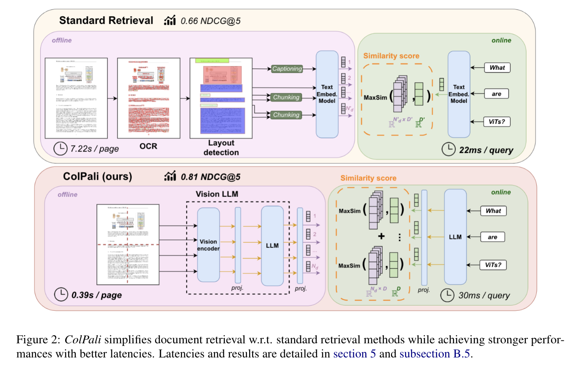
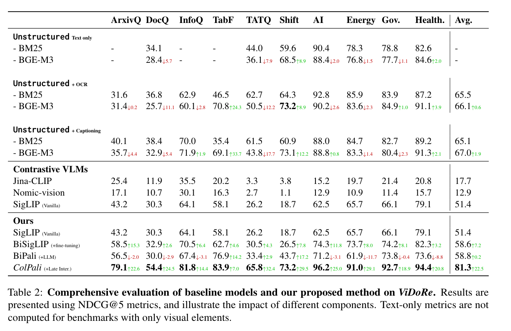

The article "ColPali: Efficient Document Retrieval with Vision Language Models" discusses the development of ColPali, a new architecture for document retrieval systems that integrates Vision Language Models (VLMs). It addresses the challenge of document retrieval systems that are traditionally strong in text-based query matching but struggle with utilizing visual cues in documents effectively. This inefficiency is particularly problematic in applications like Retrieval Augmented Generation (RAG).

The ColPali system is designed to improve retrieval performance by using VLMs to understand and index documents based on their visual elements (like images, layouts, and fonts) instead of just text. This approach allows ColPali to create high-quality, contextualized embeddings from images of document pages, enabling faster and more accurate document retrieval compared to traditional methods.

The paper also introduces the Visual Document Retrieval Benchmark (ViDoRe), which evaluates systems on their ability to retrieve documents using both textual and visual cues. ColPali significantly outperforms existing document retrieval systems in this benchmark, offering faster performance and being end-to-end trainable.

Moreover, the article details the experimental setup, model training, and the specific advantages of integrating visual features in document retrieval, showing that ColPali not only enhances retrieval accuracy but also speeds up the process due to its efficient handling of visual data.

## Key contributions

The key contributions of the "ColPali: Efficient Document Retrieval with Vision Language Models" paper are:

1. **Introduction of ViDoRe Benchmark**: The paper introduces the Visual Document Retrieval Benchmark (ViDoRe), a new benchmark specifically designed to assess the performance of document retrieval systems that utilize both textual and visual information in documents. This benchmark covers various domains, languages, and settings to provide a comprehensive evaluation framework.

2. **Development of ColPali**: The paper presents a new retrieval model architecture called ColPali, which leverages Vision Language Models (VLMs) to understand and index documents by their visual components. This model is significant for its ability to produce high-quality, contextualized embeddings directly from images of document pages, improving the quality and speed of document retrieval.

3. **Empirical Validation**: The paper provides empirical evidence showing that ColPali outperforms existing document retrieval systems in terms of accuracy and speed on the ViDoRe benchmark. This validation demonstrates the effectiveness of integrating visual cues into the retrieval process.

4. **End-to-End Trainability and Efficiency**: ColPali is highlighted for its end-to-end trainability and operational efficiency. It simplifies the document retrieval process by directly handling visual data, which reduces the complexity and increases the speed of indexing and retrieval compared to traditional methods that rely heavily on text extraction and processing.

5. **Release of Project Artifacts**: The authors have made all project artifacts, including models, code, and the ViDoRe benchmark, publicly available, fostering further research and development in the field of document retrieval with vision language models.

These contributions mark significant advancements in the field of document retrieval, particularly in handling visually rich documents effectively and efficiently.

## Relation to ColBERT

The paper introduces ColPali, which builds upon and extends the ideas from ColBERT in significant ways to improve document retrieval. Here’s how ColPali relates to and improves upon the ColBERT architecture:

1. **Integration of Vision Language Models (VLMs)**: While ColBERT is primarily designed for textual data using contextualized embeddings from BERT, ColPali extends this concept by integrating Vision Language Models. This allows ColPali to handle and interpret both the textual and visual components of documents, such as images, layouts, and fonts, which ColBERT does not natively support.

2. **Use of Multi-Vector Embeddings for Visual Data**: ColPali adapts the multi-vector embedding strategy of ColBERT (where each token of a document is independently embedded) to also include visual elements. In ColPali, both text tokens and image patches are embedded, enhancing the model's ability to perform detailed and nuanced matching based on visual as well as textual content.

3. **End-to-End Document Retrieval**: ColPali is designed to be end-to-end trainable, directly from the visual representation of document pages to retrieval outputs. This is a step forward from ColBERT’s reliance on pre-processed text data, making the system more streamlined and reducing reliance on intermediate steps like OCR or manual text extraction.

4. **Efficiency Improvements**: ColPali incorporates a late interaction mechanism similar to ColBERT but improves upon it by applying this strategy to a combined set of text and visual embeddings. This approach optimizes the retrieval process by enabling efficient similarity computations between query embeddings and document embeddings that include visual information, potentially leading to faster retrieval times and reduced computational overhead.

5. **Enhanced Retrieval Performance**: By leveraging the capabilities of Vision Language Models and processing visual information alongside text, ColPali significantly outperforms traditional text-based retrieval systems, including those based on the ColBERT architecture, particularly in environments where documents are visually rich.

In summary, ColPali not only adopts the core strengths of ColBERT, such as efficient retrieval through late interaction and multi-vector embeddings, but also significantly expands its scope by integrating visual data processing capabilities. This makes ColPali more suitable for modern document retrieval applications that must deal with a mix of text and visual content.

## Metrics

## Review questions

Here are five review questions along with their answers based on the "ColPali: Efficient Document Retrieval with Vision Language Models" article:

1. **What is the primary purpose of the ColPali model introduced in the article?**
   - **Answer**: The primary purpose of the ColPali model is to improve document retrieval performance by integrating Vision Language Models (VLMs) to understand and index both the visual and textual content of documents, enabling more efficient and accurate retrieval of visually rich documents.

2. **How does ColPali enhance the capabilities of traditional text-based document retrieval systems?**
   - **Answer**: ColPali enhances traditional systems by using VLMs to create contextualized embeddings from images of document pages, allowing it to process and index visual elements like images, layouts, and fonts alongside text. This capability significantly improves retrieval accuracy and speed in environments where documents contain important visual information.

3. **What is the ViDoRe benchmark, and why was it introduced?**
   - **Answer**: The ViDoRe (Visual Document Retrieval) benchmark is a new benchmark introduced in the paper to evaluate document retrieval systems that use both textual and visual cues. It was developed to provide a comprehensive assessment framework for systems like ColPali, helping to demonstrate their effectiveness across various domains, languages, and settings.

4. **In what ways does ColPali improve upon the ColBERT model?**
   - **Answer**: ColPali builds upon ColBERT by integrating visual processing capabilities. It extends ColBERT's textual multi-vector embedding strategy to include visual data, enabling late interaction over combined text and image embeddings. This allows ColPali to handle visually rich documents more effectively, making it end-to-end trainable and operationally more efficient than ColBERT.

5. **What are the practical implications of the improvements brought by ColPali for industries reliant on document retrieval systems?**
   - **Answer**: The improvements brought by ColPali can significantly impact industries like legal, academic, and medical fields where documents often contain critical visual elements. By efficiently indexing and retrieving both text and visual data, ColPali can help these industries access and utilize information more quickly and accurately, potentially transforming how they manage and interact with their document repositories.
