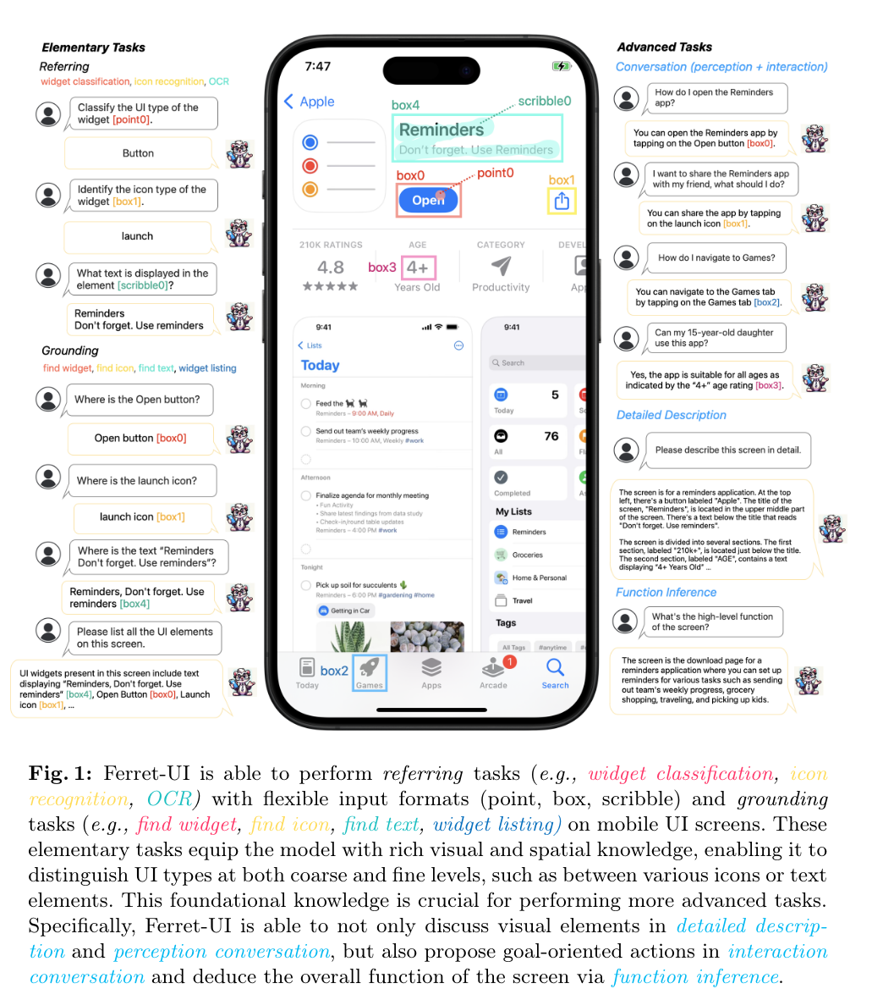
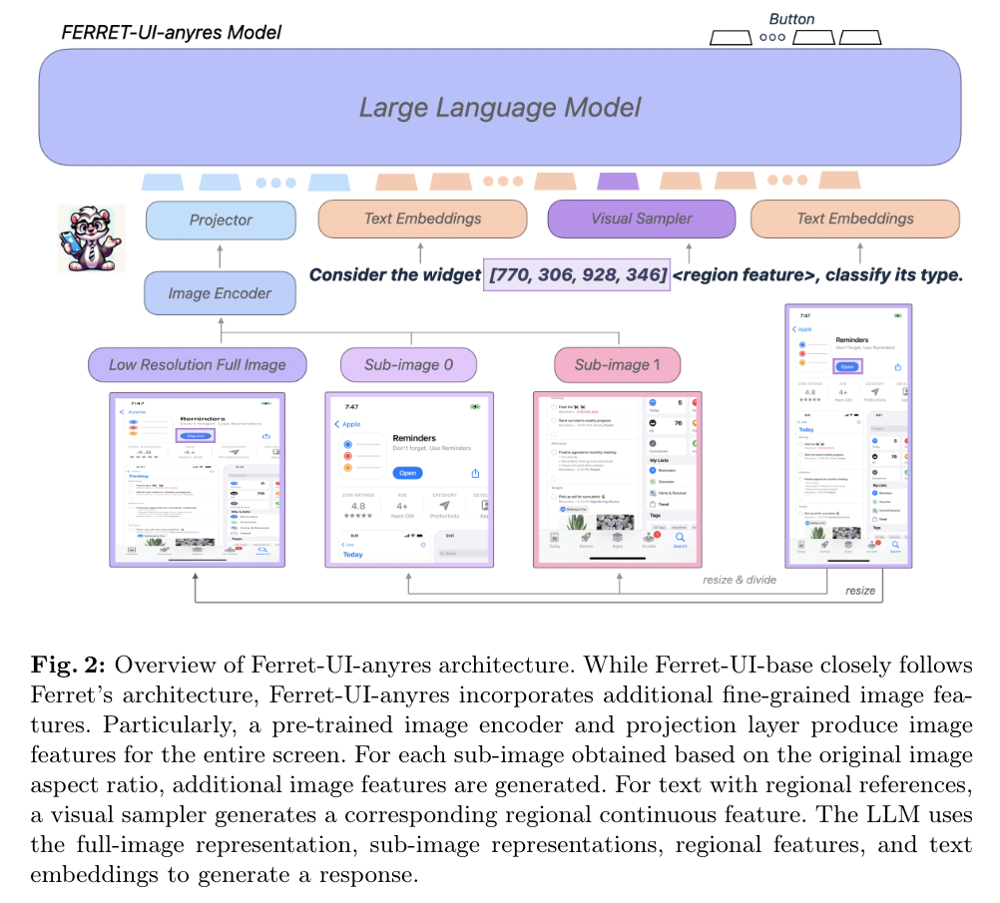
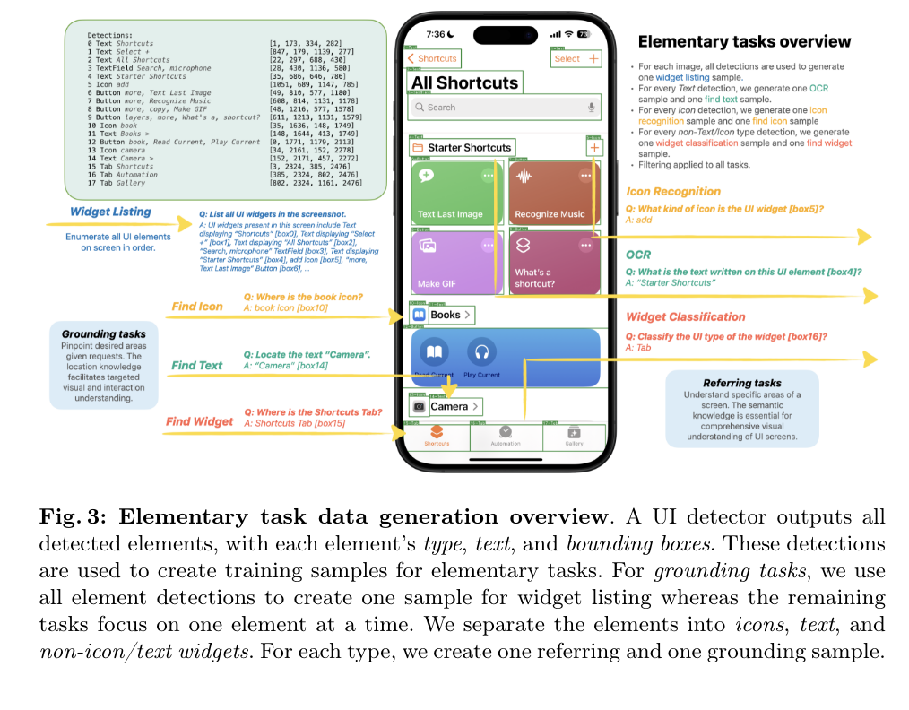
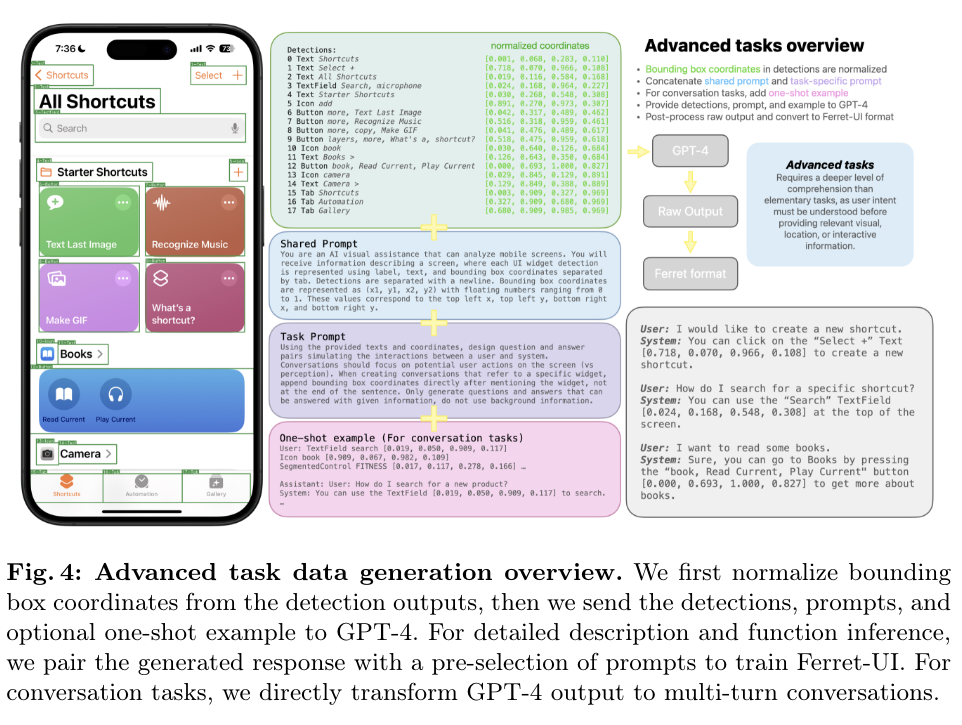

Ferret-UI is a specialized Multimodal Large Language Model (MLLM) designed specifically to enhance the understanding of mobile UI screens. It aims to address the limitations of general-domain MLLMs in interacting effectively with user interface screens by incorporating advanced capabilities for referring, grounding, and reasoning. Ferret-UI integrates an "any resolution" feature to accommodate different screen aspect ratios and contains detailed annotations for training with tasks like icon recognition, text finding, and widget listing. It is trained to perform tasks tailored to UI comprehension and can execute open-ended instructions based on the visual elements present on the screen. This model is developed to significantly improve the automation and interaction with mobile user interfaces, contributing to applications like app testing, accessibility, and more sophisticated UI navigation solutions.

Ferret-UI uses a comprehensive test benchmark that includes a range of mobile UI tasks specifically designed to evaluate its referring, grounding, and reasoning capabilities. The benchmark features 14 diverse mobile UI tasks adapted for both iPhone and Android screens. These tasks are derived from three main sources:

1. **Spotlight Tasks**: These include tasks like `screen2words`, `widget captions`, and `taperception`, which are part of the Spotlight dataset focused on mobile UI understanding.

2. **Elementary Tasks**: These tasks assess basic UI elements recognition and interaction capabilities, such as OCR (optical character recognition), icon recognition, widget classification, and various grounding tasks like finding widgets, icons, and text.

3. **Advanced Tasks**: These involve more complex interactions, including detailed description, conversation perception, conversation interaction, and function inference. These tasks are designed to test the model's ability to engage in nuanced discussions about visual components, formulate action plans, and interpret the general purpose of the screen.

This set of benchmarks is meticulously designed to cover a broad spectrum of UI understanding and interaction scenarios, ensuring a thorough evaluation of the model's performance across both basic and advanced tasks.

Generating data at different granularities for a model like Ferret-UI serves several key purposes, particularly when it comes to training multimodal large language models (MLLMs) that are specialized in mobile UI understanding:

1. **Enhancing Visual Recognition Skills**: By training on data with different levels of detail—from broad UI components to finer elements like individual icons or text—Ferret-UI can better learn to recognize and differentiate between various UI elements. This capability is crucial for accurately performing tasks such as icon recognition, text finding, and widget identification.

2. **Improving Spatial Understanding**: Different granularities help the model to understand the spatial relationships and layout specifics of UI elements on a screen. This is essential for tasks that involve spatial reasoning, such as determining the location of a button relative to other UI components or understanding how elements are grouped.

3. **Facilitating Complex Reasoning**: By exposing the model to tasks that range from simple recognition to complex interaction, the training data helps in developing the model's reasoning capabilities. Advanced tasks that require interpreting the overall function of a UI or engaging in a detailed conversation about its elements necessitate a nuanced understanding that can be fostered through varied data complexities.

4. **Customizing Response to Task Specificity**: Different tasks may require focusing on different aspects of the UI. For example, basic tasks like icon recognition might only need an understanding of individual elements, while more complex tasks like function inference require a holistic understanding of the entire interface. Training across different granularities allows Ferret-UI to adapt its responses based on the specificity of the task at hand.

5. **Increasing Robustness and Generalization**: Training on diverse data representations helps the model become more robust and generalize better across different types of UI designs and layouts. This is particularly important for deploying the model in real-world applications where UIs can vary significantly.

Overall, the approach of using data at different granularities equips Ferret-UI with a comprehensive skill set that enhances its performance and reliability in understanding and interacting with mobile user interfaces across various applications and scenarios.

The "any resolution" concept in Ferret-UI is an advanced feature designed to enhance the model's ability to accurately process and understand mobile UI screens across different device formats and orientations. This feature is crucial for adapting to the varied aspect ratios and resolutions commonly found in modern mobile devices. Here’s how it works:

1. **Accommodating Different Aspect Ratios**: Mobile devices come in various shapes and sizes, leading to a wide range of screen resolutions and aspect ratios. Ferret-UI's "any resolution" capability is designed to handle this diversity by adapting its processing to fit the specific aspect ratio of the screen being analyzed. This means the model can effectively process both portrait and landscape orientations without losing important visual information.

2. **Sub-Image Division**: Based on the original aspect ratio of the UI screen, Ferret-UI divides the screen into sub-images. For example, portrait screens might be divided horizontally, while landscape screens are divided vertically. This division strategy helps in maintaining the integrity of visual information pertinent to each part of the UI, such as top and bottom menus or side panels.

3. **Separate Encoding**: Each sub-image generated from the original screen is encoded separately. This approach allows Ferret-UI to focus on detailed features within each segment of the UI, enhancing the model's accuracy in identifying and understanding smaller or more densely packed UI elements like icons and texts.

4. **Enhanced Visual Features**: By processing sub-images and leveraging detailed encoding strategies, the "any resolution" feature magnifies important details that might otherwise be lost in a standard, uniform resolution approach. This is especially critical for screens with a lot of information or complex layouts where every pixel may carry important UI cues.

5. **Flexible Integration**: The flexibility of this approach allows Ferret-UI to effectively manage a variety of screen types and orientations, making it highly adaptable to the dynamic nature of mobile interfaces.

The "any resolution" feature significantly boosts Ferret-UI's capability to perform sophisticated tasks such as precise referring and grounding in relation to UI screens. It ensures that the model can handle the practical challenges posed by the diverse specifications of mobile devices used in real-world applications. This capability is crucial for applications requiring high levels of accuracy in UI understanding, such as accessibility enhancements, automated testing, and interactive app navigation.

## Q & A

Here is a set of five review questions along with their answers based on the article about Ferret-UI:

### Question 1
**What is Ferret-UI, and what makes it unique compared to general-domain Multimodal Large Language Models (MLLMs)?**

**Answer:**
Ferret-UI is a specialized MLLM developed specifically for enhancing the understanding of mobile UI screens. It uniquely incorporates capabilities such as referring, grounding, and reasoning that are tailored for UI comprehension, unlike general-domain MLLMs that often struggle with the specifics of user interfaces.

### Question 2
**Describe the "any resolution" feature of Ferret-UI. How does it benefit the model's performance?**

**Answer:**
The "any resolution" feature allows Ferret-UI to adaptively process and analyze screens of varying aspect ratios and resolutions. It divides the UI screen into sub-images that are encoded separately, magnifying details and maintaining visual integrity across different device formats. This ensures improved accuracy in tasks involving detailed UI element recognition and interaction.

### Question 3
**What types of tasks is Ferret-UI designed to perform, and how are these tasks categorized in its benchmark?**

**Answer:**
Ferret-UI is designed to perform a wide range of UI understanding tasks categorized into elementary, advanced, and spotlight tasks. Elementary tasks focus on basic UI elements recognition, advanced tasks involve complex reasoning and interaction with the UI, and spotlight tasks are specific to the model's capability to interpret and describe UI screens in detail.

### Question 4
**How does Ferret-UI improve spatial understanding and reasoning with mobile UIs?**

**Answer:**
By training on data at different granularities and using sub-image division, Ferret-UI enhances its spatial understanding of UI elements and their relationships. This helps the model in accurately pinpointing and interacting with specific components within a UI, crucial for performing tasks that require spatial reasoning and detailed comprehension of the interface layout.

### Question 5
**What are the potential real-world applications of Ferret-UI, and how does it contribute to them?**

**Answer:**
Ferret-UI can significantly contribute to fields such as automated UI testing, accessibility (by assisting users with visual impairments navigate UIs more effectively), app development, and user experience research. Its enhanced understanding and interaction capabilities enable it to perform automated tasks that traditionally require human comprehension, thus improving efficiency and inclusivity in technology usage.

These questions and answers can serve as a thorough review tool to help solidify understanding of the key concepts and functionalities of Ferret-UI as presented in the article.
