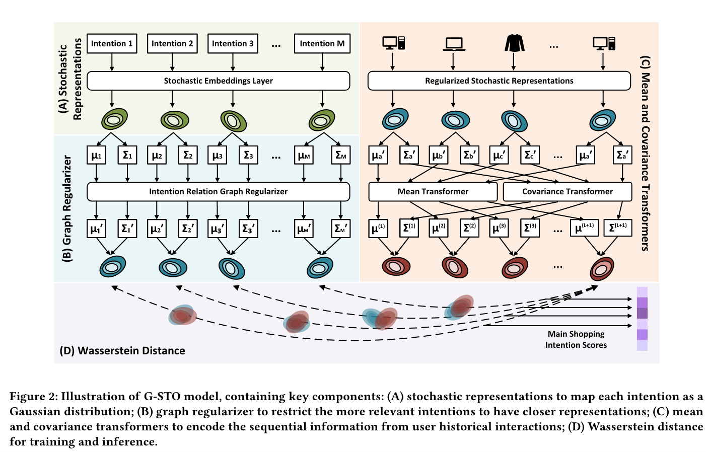
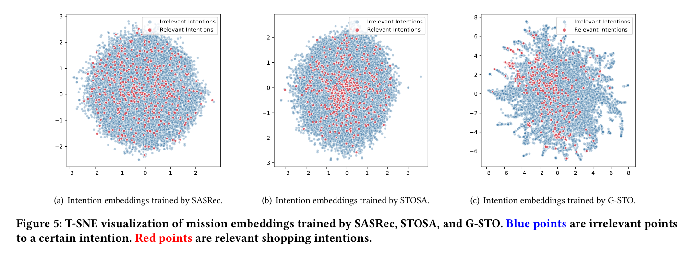
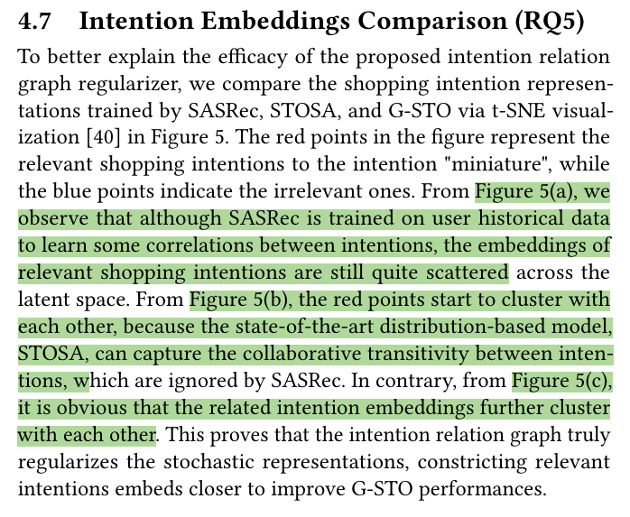

## Key contributions

The main contributions of the article titled "G-STO: Sequential Main Shopping Intention Detection via Graph-Regularized Stochastic Transformer" are:

1. **Novel Framework for Shopping Intention Detection**: The authors propose G-STO, a new graph-regularized stochastic Transformer model, which is the first to focus solely on main shopping intention identification using only intention-level data. This framework aims to enhance user understanding and improve the performance of downstream tasks such as product-level recommendations.

2. **Stochastic Gaussian Embeddings**: The model introduces stochastic representations of shopping intentions and user preferences as Gaussian distributions, capturing the high-level properties of shopping intentions, the collaborative transitivity across intentions, and the uncertainty in user preferences.

3. **Graph-Regularized Approach**: G-STO incorporates a novel graph regularizer using an intention relation graph to improve the modeling of shopping intentions. This regularizer leverages global intention relation information as prior knowledge to ensure that relevant shopping intentions are distributionally close in the latent representation space, helping to address issues like cold-start and data scarcity.

4. **Enhanced Sequential Information Modeling**: By utilizing mean and covariance transformers within their architecture, the model encodes sequential information from intention transitions more effectively. This approach diverges from traditional models by using Wasserstein distance to measure the dissimilarity between the distributions of user preferences and shopping intentions, providing a more nuanced understanding of customer behavior.

5. **Empirical Validation**: The model is validated across three real-world datasets, demonstrating significant improvements over baseline models in various metrics such as Hit@1, NDCG@10, and Hit@10.

6. **Real-world Application and Impact**: The paper discusses the implementation of G-STO in an e-commerce platform and its positive impact on revenue and sales, showcasing its practical utility and effectiveness in a commercial setting.

These contributions highlight the advancement in handling the complexity of sequential recommendation systems by incorporating stochastic embeddings and graph-based regularization, aiming to provide more accurate, personalized, and explainable recommendations.

## Architecture

## What baselines are used?

The article "G-STO: Sequential Main Shopping Intention Detection via Graph-Regularized Stochastic Transformer" compares the G-STO model against several baseline models across different categories:

### Static Recommendation Methods
1. **Count-based Bayesian (CB)**: A non-learning approach that uses the appearance frequency of shopping intentions.
2. **LightGCN**: A state-of-the-art graph-based static recommendation method, utilizing high-order collaborative signals in user-item graphs.

### Deterministic Sequential Recommendation Methods
3. **SASRec**: A self-attention-based sequential recommendation system that captures long-term semantics and short-term dynamics.

### Stochastic Sequential Recommendation Methods
4. **DT4SR**: A distribution-based method that models intentions as elliptical Gaussian distributions and uses two separate Transformer-based models to infer user preferences.
5. **STOSA**: Extends DT4SR by introducing a new stochastic self-attention mechanism, enhancing the combination of Transformer and stochastic representations.

### VAE-based Sequential Recommendation Methods
6. **SVAE**: A sequential variational autoencoder that combines a recurrent neural network (RNN) with VAE, outputting the probability distribution of the most likely future preferences.
7. **ACVAE**: A state-of-the-art VAE-based model incorporating adversarial training for sequence generation, aiming to generate high-quality latent variables.

These baseline models encompass a range of techniques from static methods to more advanced sequential and stochastic approaches, providing a comprehensive set of comparisons for evaluating the effectiveness of the G-STO model.

## Datasets used

The G-STO model is evaluated on three different real-world datasets, each tailored to reflect distinct shopping scenarios based on anonymized data from Amazon.com. These datasets are designed to capture various aspects of user behavior and shopping intentions:

1. **Original Sequences**: This dataset uses raw sequences obtained from user historical data, aiming to model long-term shopping behavior. The sequences are processed with a "leave-one-out" strategy for training, validation, and testing.

2. **24-Hours Sequences**: This dataset focuses on dense and frequent user-intention interactions sampled from raw data to model short-term shopping scenarios. It considers sequences where interactions within 24 hours are grouped together, assessing how short-term behaviors reflect shopping intentions.

3. **Purchase Sequences**: This dataset highlights purchase actions as strong indicators of main shopping intentions. It is used to model purchase-related shopping scenarios, where the purchase actions in a user's history are considered direct signals of their main shopping intentions.

These datasets allow the model to be tested in different contexts, from long-term to very immediate shopping intents, providing a robust evaluation of the model's performance across various real-world scenarios.

## T-SNE visualization of intent embeddings

## Q & A

Here are five review questions along with their answers to help you evaluate and understand the key aspects of the article "G-STO: Sequential Main Shopping Intention Detection via Graph-Regularized Stochastic Transformer":

1. **What is the primary objective of the G-STO model presented in the article?**
   - **Answer**: The primary objective of the G-STO model is to improve the detection of main shopping intentions in sequential recommendation systems by using a graph-regularized stochastic Transformer approach. This model focuses on enhancing user understanding and the accuracy of product recommendations by capturing the dynamic and complex patterns of user behavior through stochastic embeddings and graph-based regularization.

2. **How does G-STO model shopping intentions differently from traditional approaches?**
   - **Answer**: G-STO models shopping intentions as stochastic Gaussian embeddings rather than deterministic points. This approach captures the high-level taxonomy of shopping intentions as sets of products and accommodates the uncertainty and variability in user preferences, which are overlooked by traditional deterministic models.

3. **What role does the intention relation graph play in the G-STO model?**
   - **Answer**: The intention relation graph serves as a novel graph regularizer in the G-STO model. It uses global intention relation information as prior knowledge to ensure that relevant shopping intentions are closely distributed in the latent representation space. This helps in addressing cold-start issues and improves the model’s ability to infer intentions based on limited or sparse data.

4. **On what datasets is the G-STO model evaluated, and what are their purposes?**
   - **Answer**: The G-STO model is evaluated on three different real-world datasets: Original Sequences, 24-Hours Sequences, and Purchase Sequences. Each dataset is designed to test the model's performance in different contexts: long-term user behavior, short-term dense interactions, and purchase-based intentions, respectively, reflecting varied real-life shopping scenarios.

5. **What significant results or improvements does the G-STO model demonstrate compared to the baseline models?**
   - **Answer**: The G-STO model shows significant improvements over several baseline models across different metrics such as Hit@1, NDCG@10, and Hit@10. For instance, it outperforms the best baseline by 18.08% in Hit@1, 6.11% in NDCG@10, and 7.01% in Hit@10 on average across the three datasets, demonstrating its superior capability in identifying main shopping intentions with higher accuracy and relevance.

These questions can serve as a guide for revisiting the key concepts and contributions of the article in future reviews.
