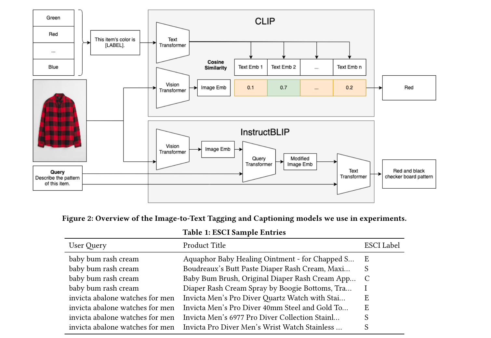
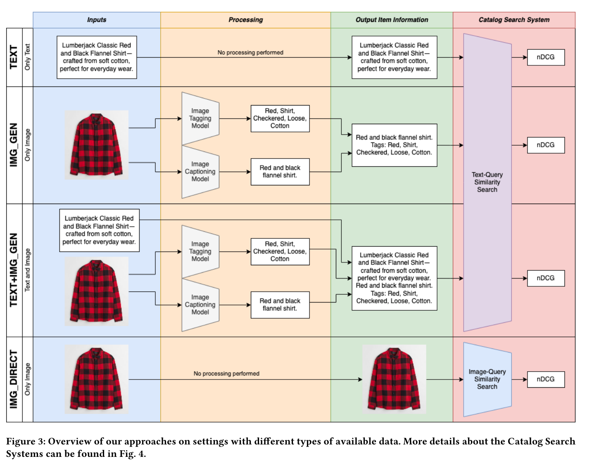
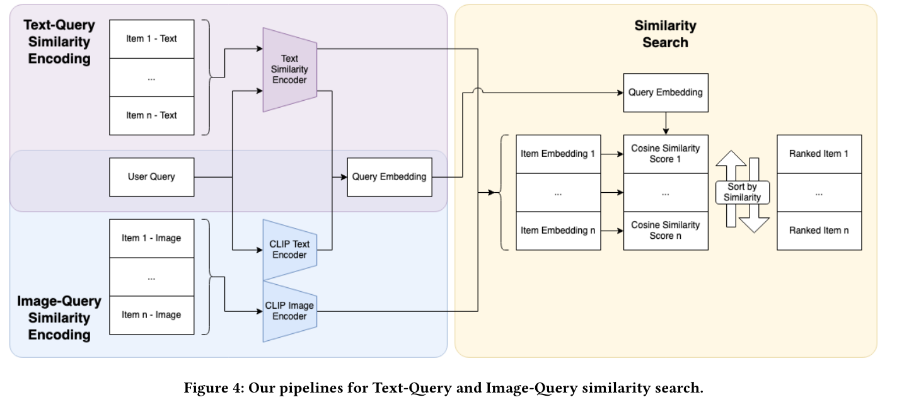

The article titled "Captions Are Worth a Thousand Words: Enhancing Product Retrieval with Pretrained Image-to-Text Models" explores the use of multimodal image-to-text models to improve text-based item retrieval. The authors utilize pretrained image captioning and tagging models, like instructBLIP and CLIP, to generate text-based product descriptions that enhance search and recommendation systems, particularly for eCommerce. This approach is especially beneficial for smaller eCommerce businesses that struggle with maintaining high-quality text descriptions.

The paper details the implementation and evaluation of these models using subsets of Amazon's ESCI dataset to demonstrate their effectiveness in generating searchable text descriptions that either complement or replace existing product metadata. The results indicate that these models can effectively enhance the retrieval of existing text and generate new, highly searchable standalone descriptions.

The study contributes to the field by demonstrating how leveraging image-generated text can improve search functions in eCommerce, particularly through the enhancement of conversational recommender systems and search engines that rely on natural language processing. Future research directions include scaling up experiments with more advanced language models and evaluating the applicability of these methods to full datasets for more comprehensive assessments.

In the article, several variants of search and recommendation methods are tested using multimodal image-to-text models. These variants primarily differ in how they utilize text and image data to enhance product retrieval in an eCommerce context. Here's a summary of the variants tested:

1. **Text Only (TEXT):** This variant uses only the original human-written item descriptions from the ESCI dataset, serving as a baseline comparison for text-query similarity search performance.

2. **Image-Generated Only (IMG_GEN):** This approach relies entirely on image-generated captions and tags to create descriptions, bypassing traditional text data.

3. **Combined Text and Image-Generated (TEXT+IMG_GEN):** This method measures the effectiveness of enhancing existing text descriptions with additional image-generated text to improve text-query similarity search performance.

4. **Direct Image to Query (IMG_DIRECT):** This variant bypasses the intermediary textual representation and directly uses images and queries, embedding them to compute cosine similarity. This approach faces challenges such as high latency and the need for costly vector databases, which are considered significant drawbacks.

These variants are evaluated to determine how well they improve item retrieval by comparing their performance against baseline models and assessing their ability to rank items in order of relevance to user queries.

## Q & A review

Here are five review questions along with their answers for the article "Captions Are Worth a Thousand Words: Enhancing Product Retrieval with Pretrained Image-to-Text Models":

1. **What is the primary objective of the research presented in the article?**
   - **Answer:** The primary objective is to enhance text-based item retrieval in eCommerce settings by using pretrained multimodal image-to-text models to generate text-based product descriptions from images.

2. **Which pretrained models are mentioned as being used in the research, and for what purpose?**
   - **Answer:** The research mentions using pretrained models like instructBLIP and CLIP. These models are used to generate text-based product descriptions from images, which are then utilized to enhance the searchability and recommendation capabilities of eCommerce platforms.

3. **How do the authors evaluate the effectiveness of their proposed methods?**
   - **Answer:** The authors evaluate the effectiveness by testing the searchability of ground-truth text, image-generated text, and combinations of both on several subsets of Amazon's publicly available ESCI dataset. They compare these results against baseline models to assess improvements.

4. **What significant results or findings are discussed in the article?**
   - **Answer:** The results show that the dual capability of the proposed models enhances the retrieval of existing text and generates standalone descriptions that are highly searchable. The models particularly help in environments where high-quality text descriptions are not available.

5. **What future research directions do the authors suggest?**
   - **Answer:** The authors suggest exploring large-scale experiments using more advanced language models, evaluating the full ESCI dataset to better assess the models' capabilities, and integrating image-generated captions into real-world applications like ElasticSearch to further test their practical utility.
