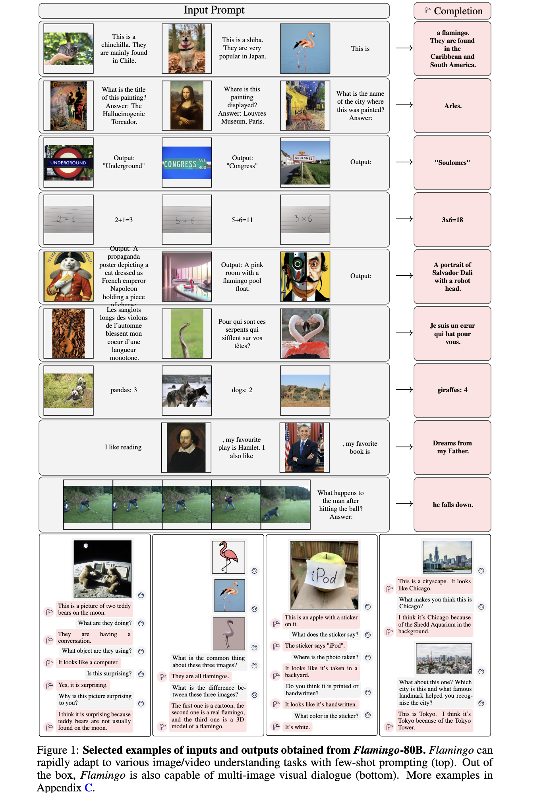
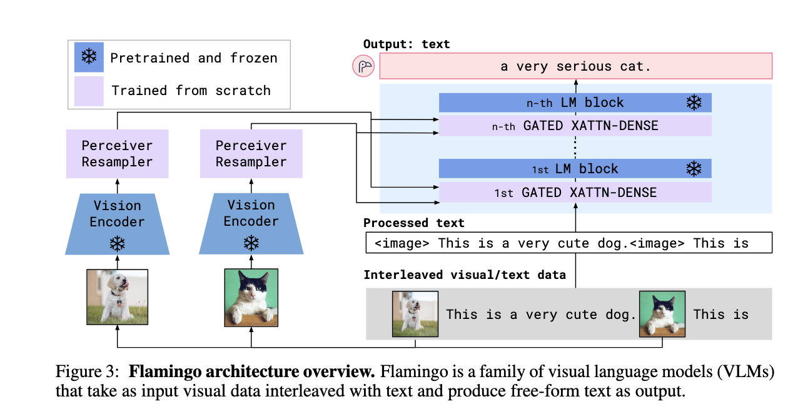
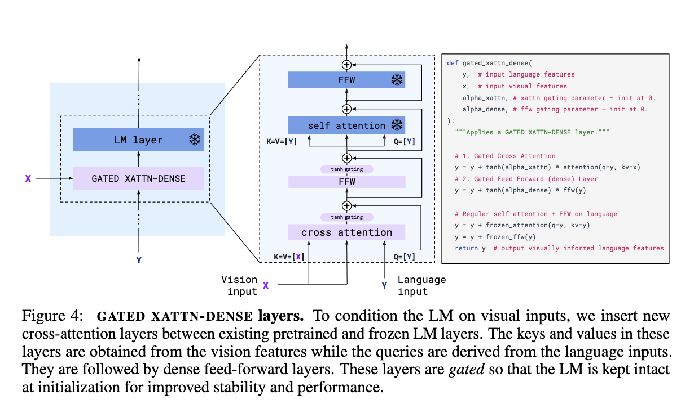
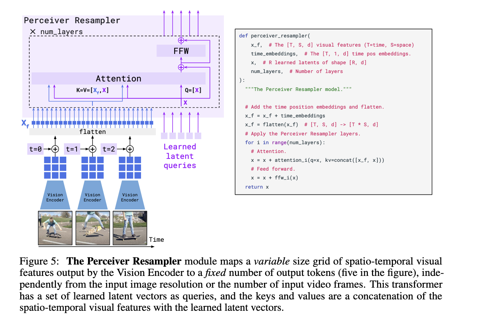

## Summary
The article on **Flamingo: a Visual Language Model for Few-Shot Learning** highlights several key contributions:

1. **Introduction of Flamingo VLMs**: The paper introduces the Flamingo family of Visual Language Models (VLMs), which can perform various multimodal tasks like captioning, visual dialogue, and visual question-answering with only a few input/output examples.

2. **Architectural Innovations**: Flamingo proposes key architectural innovations to:
   - Bridge powerful pre-trained vision-only and language-only models.
   - Handle sequences of interleaved visual and textual data.
   - Seamlessly ingest images or videos as inputs and output free-form text.

3. **Few-Shot Learning Capability**: The Flamingo models set a new state of the art in few-shot learning across a wide range of open-ended vision and language tasks. They outperform fine-tuned state-of-the-art models on six of the sixteen tasks without requiring fine-tuning on large amounts of task-specific data.

4. **Evaluation and Task Generalization**: The models are evaluated thoroughly on various tasks, including open-ended tasks like visual question answering, captioning, and closed-ended tasks like multiple-choice visual question answering. Flamingo can generalize to vision tasks through few-shot learning, making it versatile and efficient.

5. **Incorporating Pre-Trained Models**: Flamingo integrates large pre-trained models (a vision model for perception and a language model for reasoning) and introduces a Perceiver Resampler to condense high-dimensional visual data into manageable tokens for the language model. This allows the model to leverage pre-existing knowledge from vision and language tasks.

6. **Performance Across Tasks**: The paper demonstrates that a single Flamingo model can achieve state-of-the-art performance on a variety of benchmarks, including COCO, VQAv2, MSRVTTQA, VATEX, and others, across both image and video understanding tasks.

These contributions collectively represent a significant advance in multimodal machine learning, allowing Flamingo to rapidly adapt to novel tasks with minimal examples.

## Sample prompts

## Model architecture
In the **Approach** section, the paper explains how the **Flamingo** model operates. Here’s a summary:

1. **Visual Processing and Perceiver Resampler**:
   - Flamingo uses a **Vision Encoder** to process visual inputs, whether images or videos. It uses a pre-trained and frozen **Normalizer-Free ResNet (NFNet)** for this purpose.
   - The outputs from the Vision Encoder are spatio-temporal features (for videos) or spatial features (for images).
   - These visual features are fed into the **Perceiver Resampler**, which reduces the number of visual tokens to a fixed small set, enabling efficient cross-attention between visual features and the language model.
   - The Perceiver Resampler allows Flamingo to handle variable input sizes (images or videos with different resolutions) and produce a fixed number of visual tokens.

2. **Conditioning Frozen Language Models on Visual Representations**:
   - Flamingo integrates a large pre-trained and frozen **language model (LM)**, which processes text.
   - The model introduces new layers called **GATED XATTN-DENSE** layers that are interleaved with the pre-trained LM layers. These layers allow the LM to incorporate visual information from the Perceiver Resampler.
   - A **tanh-gating** mechanism ensures that at the start of training, the added visual processing layers don’t interfere with the pre-trained LM’s outputs. This helps the model learn to incorporate visual information without destabilizing the LM.

3. **Multi-Visual Input Support**:
   - Flamingo can handle multiple images or videos as input within a sequence of text. This is done using a **masked cross-attention** mechanism, where the model attends only to the most recent visual input corresponding to a given text token.
   - This design ensures that Flamingo can generalize to inputs with varying numbers of images or videos, even if it was trained with sequences containing fewer visuals.

4. **Training on a Mixture of Vision and Language Datasets**:
   - Flamingo is trained on a diverse set of multimodal datasets, including:
     - **M3W**: An interleaved image and text dataset extracted from web pages.
     - **ALIGN**: A dataset of 1.8 billion image-text pairs.
     - **LTIP**: A curated dataset of image-text pairs with high-quality descriptions.
     - **VTP**: A dataset of short videos paired with descriptive text.
   - The training process minimizes the negative log-likelihood of generating text, given interleaved sequences of text and visuals.

5. **Task Adaptation with Few-Shot Learning**:
   - Flamingo is designed to rapidly adapt to new tasks using **in-context learning**. The model can be prompted with a few examples of input-output pairs (images or videos with corresponding text), followed by a query input, allowing it to perform few-shot learning.
   - The architecture allows Flamingo to generate text outputs conditioned on visual inputs without task-specific fine-tuning, making it flexible for various tasks like image captioning, question answering, or visual dialogue.

In summary, Flamingo processes visual inputs through a pre-trained vision encoder and a Perceiver Resampler, conditions a pre-trained language model using gated cross-attention, and supports multi-visual input sequences. The model is trained on large-scale multimodal data and can perform few-shot learning with minimal task-specific examples.

## Dataset creation

The **Flamingo** model was trained using a mixture of large-scale multimodal datasets, including interleaved image-text pairs, standalone image-text pairs, and video-text pairs. Here's a breakdown of how these datasets were created:

### 1. **MultiModal MassiveWeb (M3W) Dataset**:
   - **Source**: The M3W dataset was collected by scraping **approximately 43 million webpages**.
   - **Content**: The dataset consists of interleaved sequences of text and images extracted from webpages. These sequences preserve the order and structure of the original content by determining the relative positions of text and images based on the webpage’s HTML structure.
   - **Text-Image Relationship**: <image> tags were inserted into the text sequences at the positions corresponding to images. Up to five images were selected from each document, and subsequences of 256 tokens were sampled for training.
   - **Purpose**: The goal was to create a large dataset that mimics natural multimodal data from the web, where text and images are often interleaved. This is key for enabling the model to handle in-context few-shot learning for tasks involving both visual and textual inputs.
   - **Filtering**: Documents with low-quality or inappropriate content (e.g., explicit content) were filtered out.

### 2. **ALIGN Dataset**:
   - **Source**: This dataset was sourced from **1.8 billion image-alt text pairs** collected from the web (similar to the dataset used by the ALIGN model).
   - **Content**: Each pair consists of an image and its corresponding alt text. This dataset provides a large quantity of paired image and text data.
   - **Goal**: It allows the Flamingo model to learn from a wide variety of image-caption pairs, particularly those where images are described with natural language.

### 3. **Long Text & Image Pairs (LTIP) Dataset**:
   - **Source**: This dataset was specifically curated by scraping fewer than ten websites, targeting sources with **high-quality and descriptive captions** for images.
   - **Content**: It consists of **312 million image-text pairs**, with longer and richer descriptions than those found in ALIGN (20.5 tokens per description on average compared to 12.4 tokens for ALIGN).
   - **Purpose**: LTIP was used to provide more detailed and informative image-text pairs to train Flamingo on a wide range of visual descriptions, focusing on quality over quantity.

### 4. **Video & Text Pairs (VTP) Dataset**:
   - **Source**: This dataset was collected from publicly available websites containing videos and their accompanying descriptions.
   - **Content**: It consists of **27 million short video-text pairs**, where the average video length is approximately 22 seconds. These videos are paired with descriptive captions.
   - **Purpose**: This dataset enables Flamingo to handle video-based tasks such as video captioning and video question-answering by providing rich multimodal training data that combines visual dynamics with corresponding textual descriptions.

### 5. **Data Processing and Augmentation**:
   - For all datasets, pre-processing steps included filtering out low-quality images and text, ensuring consistency in the format (e.g., adding <image> and <EOC> tokens), and augmenting the dataset by adding random subsequences and sampling strategies for robustness.

### **Dataset Deduplication**:
   - To avoid overlap between training and evaluation sets, the datasets were deduplicated by comparing image embeddings between the training data and the evaluation benchmarks. This process ensured that the model wasn't unintentionally trained on images that appear in the test sets.

### **Multi-Objective Training**:
   - The Flamingo model was trained on a mixture of these datasets using a multi-objective optimization strategy. The training objective minimized a weighted sum of negative log-likelihoods of the text given the visual inputs, with each dataset contributing differently to the final training mix.

In summary, the datasets used to train Flamingo were collected from large-scale web scraping efforts, targeting a combination of text and visual data from webpages, image-alt text pairs, and video descriptions. These datasets were processed, filtered, and augmented to provide a diverse range of multimodal training examples for the Flamingo model.

## Q&A

Here are five review questions based on the article on Flamingo, along with their answers:

### 1. **What are the primary architectural innovations introduced in the Flamingo model?**
   - **Answer**: Flamingo introduces several key architectural innovations:
     1. A **Perceiver Resampler** that reduces high-dimensional visual inputs into a fixed number of visual tokens.
     2. **Gated Cross-Attention Dense (GATED XATTN-DENSE) layers** that integrate visual information into a pre-trained frozen language model.
     3. A design to handle **arbitrarily interleaved sequences of text and visual inputs**, allowing the model to process multiple images and text in sequence.
   
### 2. **How does Flamingo handle sequences of multiple images or videos interleaved with text?**
   - **Answer**: Flamingo uses a **masked cross-attention mechanism**, which allows the model to attend to the visual tokens corresponding to the most recent image or video in the sequence while processing text. This ensures the model can generalize across varying numbers of images or videos in input sequences.

### 3. **What datasets were used to train Flamingo, and how were they created?**
   - **Answer**: Flamingo was trained using the following datasets:
     1. **M3W (MultiModal MassiveWeb)**: Collected from 43 million webpages, containing interleaved text and images.
     2. **ALIGN**: A dataset of 1.8 billion image-alt text pairs.
     3. **LTIP (Long Text & Image Pairs)**: Consisting of 312 million image-text pairs with richer descriptions.
     4. **VTP (Video & Text Pairs)**: A dataset of 27 million short video-text pairs.
     These datasets were sourced from the web, filtered, and deduplicated to ensure high-quality multimodal data.

### 4. **How does Flamingo perform few-shot learning, and why is it significant?**
   - **Answer**: Flamingo uses **in-context few-shot learning**, where it is provided with a small number of input-output examples (images or videos and their corresponding text) as a prompt. The model adapts rapidly to new tasks using these few examples without requiring fine-tuning. This is significant because Flamingo achieves **state-of-the-art performance** on multiple tasks with minimal task-specific data.

### 5. **What are some key benchmarks and tasks on which Flamingo outperforms other models?**
   - **Answer**: Flamingo sets a new state of the art on tasks like **COCO captioning**, **VQAv2**, **MSRVTTQA**, and **VATEX**. It surpasses other models in few-shot learning for tasks such as visual question-answering, video understanding, and image captioning, despite using significantly less task-specific training data. 

These questions and answers will help with a comprehensive review of the key concepts and innovations of the Flamingo model.

