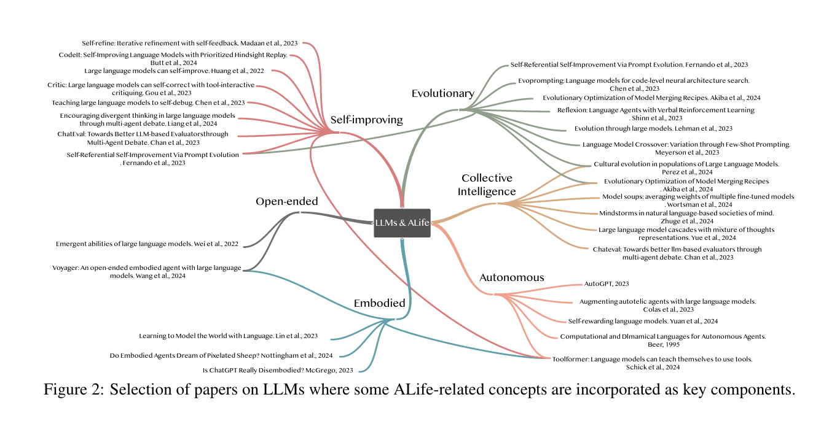
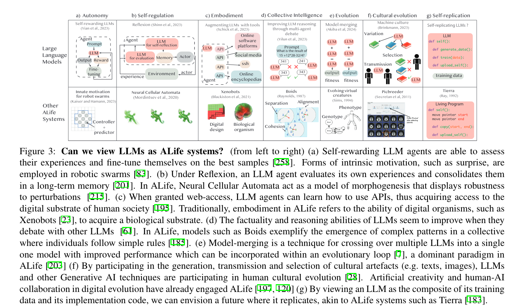

### Key Concepts of the Article "From Text to Life: On the Reciprocal Relationship between Artificial Life and Large Language Models"

#### Introduction
- **Artificial Life (ALife)**: Study and creation of lifelike systems using computer models, algorithms, and physical hardware to understand living systems' principles.
- **Large Language Models (LLMs)**: Advanced AI models capable of generating text and exhibiting properties like self-organization, collective intelligence, and evolvability.
- **Interplay between ALife and LLMs**: Investigates how LLMs can aid ALife research and vice versa, aiming to inspire innovative crossover approaches.

#### Background
- **ALife**: Focuses on two perspectives - evolutionary (Neo-Darwinism) and ecological (autopoietic systems), aiming to understand and build systems with lifelike properties.
- **LLMs**: Generative models of language using the Transformer architecture, which has enabled large-scale training and modeling of complex sequences.

#### LLMs as Tools for ALife
1. **Artificial Evolution and LLMs**: Utilizing LLMs as intelligent mutation operators to enhance evolutionary computation's efficiency.
2. **Environment Generation**: Leveraging LLMs to create diverse and controllable environments for studying ALife.
3. **Exploration**: Using LLMs for guiding exploration in open-ended tasks and maintaining libraries of skills.
4. **Modeling Human Behavior**: LLMs exhibit human-like biases in social interactions and decision-making, useful for cultural evolution studies.
5. **Scientific Collaboration**: LLMs as potential scientific collaborators due to their knowledge captured from large scientific corpora.

#### ALife Principles for Enhancing LLMs
1. **Internal States**: LLMs currently lack self-sustained activity and have limited context windows, but efforts are underway to augment them with external memory and feedback mechanisms.
2. **Autonomy**: LLM agents can demonstrate autonomy through self-rewarding mechanisms and self-optimization, evolving towards more dynamic goal representation and selection.
3. **Self-Replication**: LLM agents exhibit early forms of self-replication, crucial for transmitting information across generations.
4. **Self-Organization**: Essential for adaptive and resilient systems, but LLM agents currently do not exhibit strong self-organized properties.
5. **Emergence**: Investigating emergent behaviors from scaling LLMs, similar to complex systems in ALife.
6. **Self-Regulation**: Exploring LLMs' ability to self-regulate and self-repair to improve adaptability.
7. **4E Cognition Framework**: Embedding, embodying, enacting, and extending LLM agents to enhance cognitive processes and interactions with the environment.
8. **Collective Intelligence**: Utilizing multi-agent collaborations to enhance LLM abilities through collective behaviors.
9. **Evolution**: Combining evolutionary processes with model merging to create and improve LLMs across generations.

#### Discussion
- **Potential and Challenges**: Emphasizes the mutual benefits and advancements from integrating ALife and LLM research. However, highlights challenges related to complexity, data quality, energy consumption, and ethical implications.
- **Future Directions**: Calls for a dialogue between ALife and LLM communities to address these challenges and advance the fields.

This article underscores the promising synergy between ALife and LLM research, advocating for a reciprocal relationship to drive innovation and understanding in both fields.

