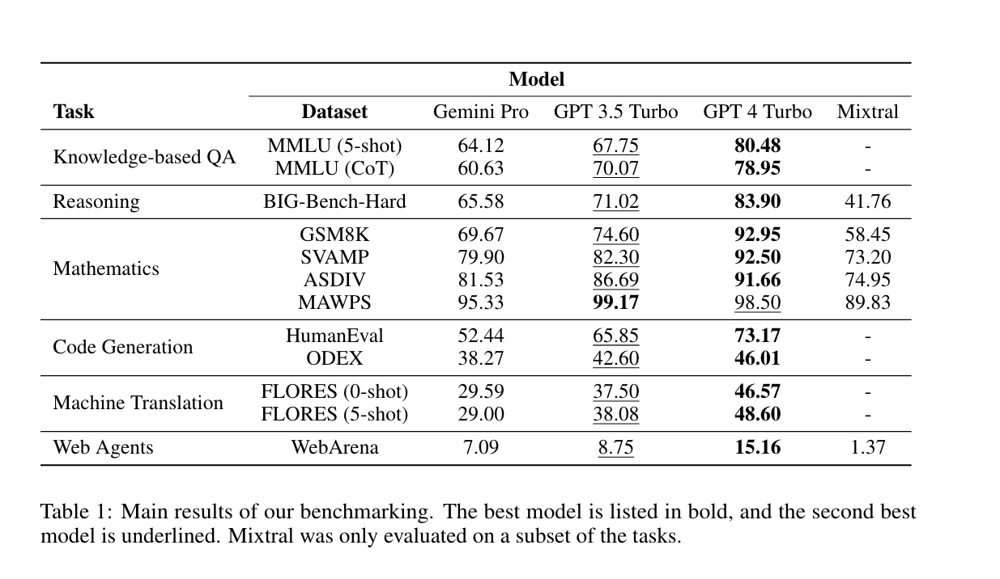

The article examines Google's Gemini language models in comparison with OpenAI's GPT series through rigorous third-party testing. It begins by detailing the methodology of the evaluation, which encompasses a range of language tasks such as reasoning, translation, and code generation across several datasets. The Gemini models, particularly the "Pro" version, show strong performance in language translation tasks but exhibit slightly inferior results to GPT 3.5 Turbo in English-language evaluations. Notably, Gemini Pro excels in translating into various languages it supports, although it sometimes struggles with tasks that involve mathematical reasoning or have complex logical structures.

Further into the analysis, the article delves into specific performance metrics where Gemini Pro generally falls short of GPT 3.5 Turbo, especially in tasks requiring complex reasoning or handling of large numerical data. However, it performs comparably or even outperforms in translation tasks for supported languages. The evaluation also highlights some limitations like the tendency of Gemini models to underperform in multi-choice format questions due to a bias in answer selection. Overall, while Gemini shows promise in certain areas, it still lags slightly behind OpenAI's offerings in terms of overall versatility and capability in English language tasks, with room for improvement in handling complex reasoning and less biased answer processing in assessments.

## Results

## List of benchmarks

1. **Knowledge-based QA (MMLU)**: This benchmark tests the model's ability to answer a variety of knowledge-based questions, covering topics from STEM to the humanities, using multiple-choice formats to evaluate broad understanding.

2. **Reasoning (BIG-Bench-Hard)**: This set of tasks evaluates the model's reasoning abilities across different contexts, including logic puzzles, symbolic reasoning, and arithmetic problems, to assess how well models can handle complex cognitive tasks.

3. **Mathematics (GSM8K, SVAMP, ASDIV, MAWPS)**: These benchmarks involve solving math word problems that require understanding and manipulating numerical information and algebraic expressions, reflecting diverse language patterns and problem complexities.

4. **Code Generation (HumanEval, ODEX)**: These benchmarks assess the ability of models to understand and generate code, testing comprehension of programming concepts and the capability to apply them in synthesizing functioning software components.

5. **Machine Translation (FLORES)**: Focused on the model's capability to translate sentences between various language pairs, especially from English to other languages, this benchmark measures linguistic adaptability and accuracy in multilingual contexts.

6. **Web Agents (WebArena)**: This benchmark tests models on their ability to act as instruction-following agents that perform complex tasks over the web, requiring navigation, information retrieval, and interaction with various online platforms.

## Takeaway

The article highlights that while Google's Gemini models demonstrate promising capabilities, particularly in language translation, they generally underperform compared to OpenAI's GPT series, especially on tasks requiring complex reasoning and English language processing. Gemini Pro shows potential in specific areas like multilingual translation but still faces challenges in tasks involving deep reasoning and unbiased decision-making in multiple-choice formats.
