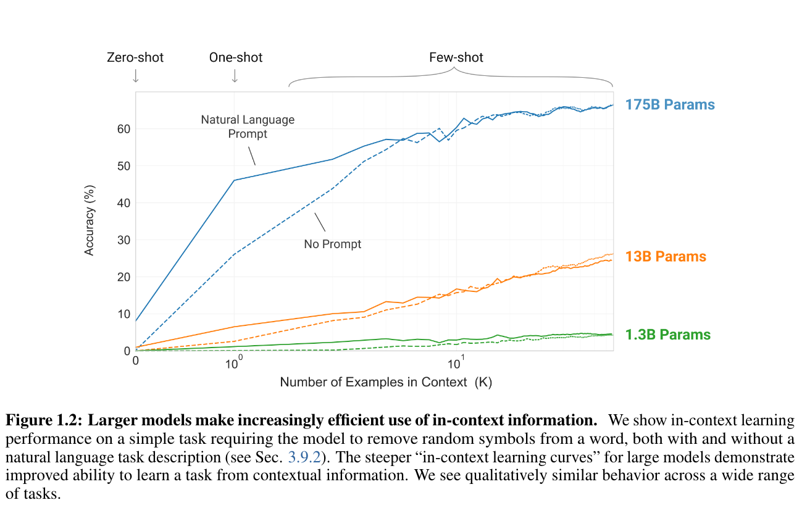
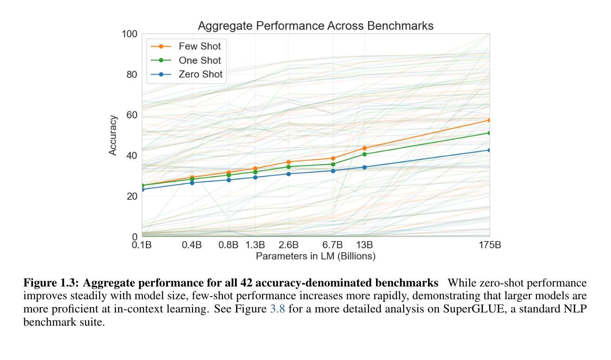
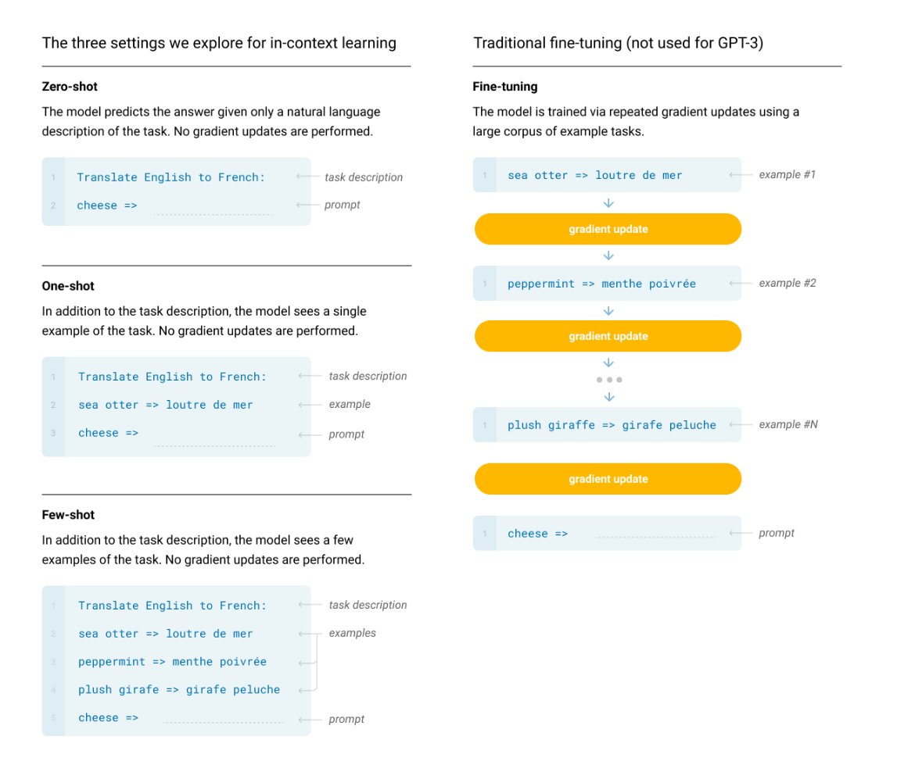

The article, titled "Language Models are Few-Shot Learners," presents the development and evaluation of GPT-3, a state-of-the-art language model by OpenAI. GPT-3, with its 175 billion parameters, represents a significant leap in the ability of language models to perform a wide range of tasks without task-specific data, achieving strong performance in many NLP tasks through few-shot, one-shot, and zero-shot learning. This approach contrasts with previous models that required extensive fine-tuning on large datasets for specific tasks. The model demonstrates proficiency in tasks such as translation, question-answering, and cloze tasks, among others. Despite its capabilities, GPT-3 also has limitations, including issues related to bias, fairness, and societal impacts. The paper explores these areas, emphasizing the importance of further research to understand and mitigate potential harms. Additionally, the energy consumption of training such large models is discussed, highlighting the need for efficiency and responsible use of resources in future developments.

## Contributions

The main contributions of the paper "Language Models are Few-Shot Learners" are as follows:

1. **Development of GPT-3:** The paper introduces GPT-3, an autoregressive language model with 175 billion parameters, which is an order of magnitude larger than any previous non-sparse language model.

2. **Few-Shot Learning:** It demonstrates that scaling up language models significantly improves their ability to perform a wide range of tasks in a few-shot setting. This means GPT-3 can understand and perform new language tasks given just a few examples, without the need for task-specific training data or fine-tuning.

3. **Broad Range of Tasks:** GPT-3 shows strong performance across many natural language processing (NLP) tasks, including translation, question-answering, cloze tasks, and even tasks requiring on-the-fly reasoning or domain adaptation. This showcases the model's general applicability and versatility.

4. **Analysis of Limitations:** The paper discusses the limitations of GPT-3, including challenges related to bias, fairness, representation, and the societal impacts of powerful language models. It emphasizes the importance of addressing these issues in future research.

5. **Broader Impacts and Societal Concerns:** The paper thoroughly examines the potential broader impacts of GPT-3, including the positive applications of language models and the risks associated with their misuse. It also discusses the environmental impact of training large-scale models like GPT-3.

6. **Benchmarking Performance:** GPT-3's performance is benchmarked on a range of NLP datasets, establishing new state-of-the-art results in several cases. The paper provides an extensive evaluation that helps in understanding the capabilities and weaknesses of the model.

These contributions mark significant advancements in the field of natural language processing and demonstrate the potential of large-scale language models to perform a wide variety of tasks with minimal task-specific input.

## Evaluation tasks presented

The paper "Language Models are Few-Shot Learners" presents a comprehensive evaluation of GPT-3 across a broad array of tasks, demonstrating its versatility and capability in few-shot, one-shot, and zero-shot settings. The tasks presented in the paper include:

1. **Language Modeling and Completion Tasks:** Evaluates GPT-3's performance on traditional language modeling, including the Penn Tree Bank dataset and LAMBADA dataset for text completion that requires understanding of context over long passages.

2. **Closed Book Question Answering:** Tests GPT-3's ability to answer questions without external knowledge sources, using datasets like Natural Questions, WebQuestions, and TriviaQA.

3. **Translation:** Assesses GPT-3's translation abilities across several language pairs, highlighting its potential for unsupervised machine translation.

4. **Winograd-Style Tasks:** Investigates GPT-3's performance on Winograd Schema Challenge and Winogrande, which require resolving pronoun disambiguation to understand subtle nuances in language.

5. **Common Sense Reasoning:** Uses datasets such as PIQA (Physical IQA), ARC (AI2 Reasoning Challenge), and OpenBookQA to evaluate GPT-3's reasoning abilities and understanding of the physical world.

6. **Reading Comprehension:** Measures GPT-3's capability to comprehend and answer questions from texts, using benchmarks like CoQA, DROP, QuAC, SQuADv2, and RACE.

7. **SuperGLUE Benchmark:** A suite of challenging language understanding tasks including BoolQ, CB, COPA, MultiRC, ReCoRD, RTE, WiC, and WSC, testing various aspects of language understanding, inference, and reasoning.

8. **Synthetic and Qualitative Tasks:** Explores GPT-3's performance on creatively generated tasks such as arithmetic calculations, word unscrambling, SAT-style analogies, and using novel words in sentences to test its adaptability and on-the-fly learning capabilities.

9. **News Article Generation:** A qualitative assessment of GPT-3's ability to generate coherent and plausible news articles, analyzing its potential for content creation and the challenges in distinguishing between model-generated and human-written text.

These tasks collectively showcase GPT-3's broad applicability across diverse language processing challenges, demonstrating its advancements in understanding and generating human-like text across different contexts and formats.

## Zero, one-shot, few-shot

## Review questions 

Here are five review questions and their answers based on the contents of the "Language Models are Few-Shot Learners" paper:

1. **What is GPT-3, and how does it differ from its predecessors?**
   - **Answer:** GPT-3 (Generative Pre-trained Transformer 3) is a state-of-the-art autoregressive language model developed by OpenAI, featuring 175 billion parameters. It significantly differs from its predecessors in scale, being an order of magnitude larger than the previous largest non-sparse language model. This scale enables GPT-3 to perform a wide range of language processing tasks in few-shot, one-shot, and zero-shot settings without task-specific training or fine-tuning.

2. **What is few-shot learning, and how does GPT-3 utilize it?**
   - **Answer:** Few-shot learning refers to the ability of a model to perform a task accurately given only a few examples or demonstrations. GPT-3 utilizes few-shot learning by generating responses to new tasks based on a small number of examples provided in its prompt, effectively adapting to new tasks without the need for additional training or fine-tuning on task-specific datasets.

3. **Can you name at least three tasks that GPT-3 was evaluated on, and describe its performance?**
   - **Answer:** GPT-3 was evaluated on a variety of tasks, including:
     - **Language Modeling and Completion Tasks:** It achieved strong performance on the Penn Tree Bank and LAMBADA datasets, showcasing its ability in text completion and understanding context.
     - **Closed Book Question Answering:** GPT-3 showed proficiency in answering trivia questions without external knowledge sources on datasets like TriviaQA, Natural Questions, and WebQuestions.
     - **Translation:** Despite not being fine-tuned for translation, GPT-3 demonstrated notable translation capabilities across several language pairs, illustrating unsupervised machine translation potential.

4. **What are some identified limitations of GPT-3 according to the paper?**
   - **Answer:** The paper identifies several limitations of GPT-3, including biases in the data leading to potential stereotypes in generated text, challenges related to fairness and representation, the model's environmental impact due to the energy consumed during training, and its large size which might limit practical applicability for real-time applications or on devices with limited resources.

5. **How does the paper address the societal impacts and potential misuse of GPT-3?**
   - **Answer:** The paper discusses the broader societal impacts of GPT-3, highlighting both its beneficial applications and potential for misuse, such as generating misleading information, spam, or phishing content. It emphasizes the importance of future research to understand and mitigate these harms and suggests the need for careful consideration of the model's biases and its environmental footprint.
  
   - 
