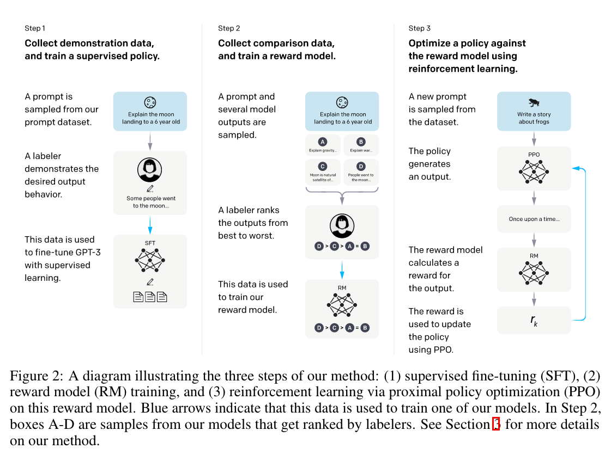

The RLHF paper.

  

The paper "Training Language Models to Follow Instructions with Human Feedback" by OpenAI discusses the limitations of large language models (LMs), particularly their tendency to produce outputs that are untruthful, toxic, or unhelpful. The authors propose a method to better align these models with user intent by fine-tuning them using human feedback. The process involves two main steps:

1. **Supervised Fine-Tuning**: Collecting a dataset of labeler-written prompts and desired model behaviors to fine-tune GPT-3 using supervised learning.
2. **Reinforcement Learning from Human Feedback (RLHF)**: Gathering a dataset of human-labeled rankings of model outputs and using this data to further fine-tune the model through reinforcement learning.

The resulting model, named **InstructGPT**, demonstrated improved alignment with user intent, outperforming the larger 175B parameter GPT-3 model despite having significantly fewer parameters (1.3B). InstructGPT also showed improvements in generating truthful and less toxic outputs with minimal performance regression on public NLP datasets.

Key findings include:
- InstructGPT outputs are generally preferred by human evaluators over those from GPT-3.
- InstructGPT generates more truthful answers and fewer toxic outputs.
- Performance regressions on certain NLP tasks were minimized through a modified fine-tuning procedure.

The study suggests that fine-tuning with human feedback is a promising approach to aligning language models with human intent, despite some remaining limitations, such as occasional simple mistakes and the challenge of fully mitigating harmful outputs.

## How it advances the field?
### Key Points of the Article

1. **Problem Identification**:
   - Large language models (LMs) often produce untruthful, toxic, or unhelpful outputs.
   - Increasing model size does not inherently improve alignment with user intent.

2. **Proposed Solution**:
   - Introduces **InstructGPT**, a model fine-tuned using human feedback to better follow instructions.
   - Utilizes a two-step fine-tuning process:
     - **Supervised Fine-Tuning**: Using labeler-written prompts to fine-tune the model.
     - **Reinforcement Learning from Human Feedback (RLHF)**: Using human-labeled rankings to further fine-tune the model.

3. **Implementation**:
   - Initial data collection from OpenAI API prompts and labeler-written prompts.
   - Training involves supervised learning followed by reinforcement learning using the Proximal Policy Optimization (PPO) algorithm.
   - Three model sizes (1.3B, 6B, and 175B parameters) were tested.

4. **Evaluation and Results**:
   - **Human Preference**: InstructGPT outputs were preferred over GPT-3 outputs, even with significantly fewer parameters.
   - **Truthfulness and Toxicity**: InstructGPT showed improvements in truthfulness and reductions in toxic output generation.
   - **Performance**: Maintained performance on public NLP datasets with minimal regressions.

5. **Limitations and Future Work**:
   - InstructGPT still makes simple mistakes and can generate harmful outputs under certain conditions.
   - More work is needed to generalize alignment to broader groups of users and to inputs where humans disagree about the desired behavior.

### Advancements in the Field

1. **Alignment with Human Intent**:
   - Demonstrates a practical method for aligning LMs with user intent, which is a significant step towards making AI more useful and safe.
   - Shows that RLHF can effectively improve model behavior beyond what can be achieved by simply increasing model size.

2. **Human Feedback Integration**:
   - Highlights the effectiveness of integrating human feedback directly into the training process, providing a pathway for more controlled and reliable model outputs.

3. **Performance vs. Model Size**:
   - Provides evidence that smaller, well-aligned models can outperform larger, less-aligned models in tasks requiring adherence to user instructions.
   - Suggests that fine-tuning with human feedback can be a more cost-effective approach compared to merely increasing model size.

4. **Evaluation Framework**:
   - Introduces a robust evaluation framework combining human preferences and automatic metrics to assess model performance in alignment tasks.
   - Demonstrates the need for models to generalize across diverse prompts and languages, pushing the boundaries of current NLP capabilities.

5. **Practical Implications**:
   - Offers a scalable method that can be applied to current and future LMs, facilitating their use in real-world applications where following human instructions accurately is crucial.
   - Provides insights into the practical challenges and solutions for deploying aligned models in production environments.

By addressing the misalignment of language models with human intentions and demonstrating effective techniques to mitigate this, the article significantly contributes to the development of safer and more reliable AI systems.

## Questions and answers

### Review Questions with Answers

1. **Question**: What is the main problem that the article addresses regarding large language models?
   **Answer**: The article addresses the issue that large language models often produce outputs that are untruthful, toxic, or unhelpful, and increasing the model size does not inherently improve alignment with user intent.

2. **Question**: What is InstructGPT and how is it different from previous language models like GPT-3?
   **Answer**: InstructGPT is a model fine-tuned using human feedback to better follow user instructions. It differs from GPT-3 in that it undergoes a two-step fine-tuning process: supervised learning using labeler-written prompts and reinforcement learning from human feedback (RLHF) to improve alignment with human intent.

3. **Question**: How does the fine-tuning process of InstructGPT work?
   **Answer**: The fine-tuning process of InstructGPT involves two main steps:
   - **Supervised Fine-Tuning**: Fine-tuning the model with a dataset of labeler demonstrations of desired behaviors.
   - **Reinforcement Learning from Human Feedback (RLHF)**: Further fine-tuning the model using human-labeled rankings of model outputs, optimizing the model with the Proximal Policy Optimization (PPO) algorithm.

4. **Question**: What are the key results obtained from evaluating InstructGPT?
   **Answer**: The key results from evaluating InstructGPT are:
   - Outputs from the 1.3B parameter InstructGPT model were preferred over those from the 175B GPT-3 model.
   - InstructGPT showed improvements in truthfulness and reductions in toxic output generation.
   - The performance regressions on public NLP datasets were minimal, indicating that the fine-tuning process maintained model performance on these tasks.

5. **Question**: What are the limitations of InstructGPT mentioned in the article?
   **Answer**: The limitations of InstructGPT include:
   - It still makes simple mistakes and can generate harmful outputs under certain conditions.
   - There is a need for more work to generalize alignment to broader groups of users and to handle inputs where humans might disagree about the desired behavior.
   - The model's behavior is influenced by the specific group of labelers and researchers involved in the training process, which may not fully represent the diversity of potential users and their preferences.

## Notes

### Annotations  

(5/20/2024, 2:08:57 PM)

“Making language models bigger does not inherently make them better at following a user’s intent.” ([Ouyang et al., 2022, p. 1](zotero://select/library/items/8NMYS97R)) ([pdf](zotero://open-pdf/library/items/H4ZD3STM?page=1&annotation=KEB5NWIE))

“these models are not aligned with their users.” ([Ouyang et al., 2022, p. 1](zotero://select/library/items/8NMYS97R)) ([pdf](zotero://open-pdf/library/items/H4ZD3STM?page=1&annotation=XRAY9IXE))

“We call the resulting models InstructGPT” ([Ouyang et al., 2022, p. 1](zotero://select/library/items/8NMYS97R)) ([pdf](zotero://open-pdf/library/items/H4ZD3STM?page=1&annotation=TCD6FWIM))

“In human evaluations on our prompt distribution, outputs from the 1.3B parameter InstructGPT model are preferred to outputs from the 175B GPT-3, despite having 100x fewer parameters.” ([Ouyang et al., 2022, p. 1](zotero://select/library/items/8NMYS97R)) ([pdf](zotero://open-pdf/library/items/H4ZD3STM?page=1&annotation=Z9VFNN6B))

“used for many recent large LMs—predicting the next token on a webpage from the internet—is different from the objective “follow the user’s instructions helpfully and safely” ([Ouyang et al., 2022, p. 2](zotero://select/library/items/8NMYS97R)) ([pdf](zotero://open-pdf/library/items/H4ZD3STM?page=2&annotation=T6K5MXGS))

“we say that the language modeling objective is misaligned.” ([Ouyang et al., 2022, p. 2](zotero://select/library/items/8NMYS97R)) ([pdf](zotero://open-pdf/library/items/H4ZD3STM?page=2&annotation=YK8RDWHG))

“Specifically, we use reinforcement learning from human feedback (RLHF;” ([Ouyang et al., 2022, p. 2](zotero://select/library/items/8NMYS97R)) ([pdf](zotero://open-pdf/library/items/H4ZD3STM?page=2&annotation=JPCZ3BZC))

“We first hire a team of 40 contractors to label our data, based on their performance on a screening test” ([Ouyang et al., 2022, p. 2](zotero://select/library/items/8NMYS97R)) ([pdf](zotero://open-pdf/library/items/H4ZD3STM?page=2&annotation=2TK5QSVE))

“Next, we collect a dataset of human-labeled comparisons between outputs from our models on a larger set of API prompts” ([Ouyang et al., 2022, p. 2](zotero://select/library/items/8NMYS97R)) ([pdf](zotero://open-pdf/library/items/H4ZD3STM?page=2&annotation=9BU2S2Z5))

“We then train a reward model (RM) on this dataset to predict which model output our labelers would prefer. Finally, we use this RM as a reward function and fine-tune our supervised learning baseline to maximize this reward using the PPO algorithm” ([Ouyang et al., 2022, p. 2](zotero://select/library/items/8NMYS97R)) ([pdf](zotero://open-pdf/library/items/H4ZD3STM?page=2&annotation=793KGLJV))

“Labelers significantly prefer InstructGPT outputs over outputs from GPT-3. On our test set,” ([Ouyang et al., 2022, p. 3](zotero://select/library/items/8NMYS97R)) ([pdf](zotero://open-pdf/library/items/H4ZD3STM?page=3&annotation=NYNIZ86F))

“InstructGPT models show improvements in truthfulness over GPT-3. On the TruthfulQA” ([Ouyang et al., 2022, p. 3](zotero://select/library/items/8NMYS97R)) ([pdf](zotero://open-pdf/library/items/H4ZD3STM?page=3&annotation=IQYIFYRN))

“InstructGPT shows small improvements in toxicity over GPT-3, but not bias. To measure” ([Ouyang et al., 2022, p. 3](zotero://select/library/items/8NMYS97R)) ([pdf](zotero://open-pdf/library/items/H4ZD3STM?page=3&annotation=LRGTQIWW))

“We can minimize performance regressions on public NLP datasets by modifying our RLHF” ([Ouyang et al., 2022, p. 3](zotero://select/library/items/8NMYS97R)) ([pdf](zotero://open-pdf/library/items/H4ZD3STM?page=3&annotation=CVBJGDTL))

“performance” ([Ouyang et al., 2022, p. 3](zotero://select/library/items/8NMYS97R)) ([pdf](zotero://open-pdf/library/items/H4ZD3STM?page=3&annotation=RWPMVUY9))

“Our models generalize to the preferences of “held-out” labelers that did not produce any train-” ([Ouyang et al., 2022, p. 4](zotero://select/library/items/8NMYS97R)) ([pdf](zotero://open-pdf/library/items/H4ZD3STM?page=4&annotation=E85EXAQA))

“Public NLP datasets are not reflective of how our language models are used. We compare” ([Ouyang et al., 2022, p. 4](zotero://select/library/items/8NMYS97R)) ([pdf](zotero://open-pdf/library/items/H4ZD3STM?page=4&annotation=DMWX89RR))

“Step 1: Collect demonstration data, and train a supervised policy. Our labelers provide demonstrations of the desired behavior on the input prompt distribution (see Section 3.2 for details on this distribution). We then fine-tune a pretrained GPT-3 model on this data using supervised learning. Step 2: Collect comparison data, and train a reward model. We collect a dataset of comparisons between model outputs, where labelers indicate which output they prefer for a given input. We then train a reward model to predict the human-preferred output. Step 3: Optimize a policy against the reward model using PPO. We use the output of the RM as a scalar reward. We fine-tune the supervised policy to optimize this reward using the PPO algorithm (Schulman et al., 2017). Steps 2 and 3 can be iterated continuously; more comparison data is collected on the current best policy, which is used to train a new RM and then a new policy. In practice, most of our comparison data comes from our supervised policies, with some coming from our PPO policies.” ([Ouyang et al., 2022, p. 6](zotero://select/library/items/8NMYS97R)) ([pdf](zotero://open-pdf/library/items/H4ZD3STM?page=6&annotation=X764E4TQ))

“To train the very first InstructGPT models, we asked labelers to write prompts themselves. This is because we needed an initial source of instruction-like prompts to bootstrap the process, and these kinds of prompts weren’t often submitted to the regular GPT-3 models on the API. We asked labelers to write three kinds of prompts: • Plain: We simply ask the labelers to come up with an arbitrary task, while ensuring the tasks had sufficient diversity. • Few-shot: We ask the labelers to come up with an instruction, and multiple query/response pairs for that instruction. • User-based: We had a number of use-cases stated in waitlist applications to the OpenAI API. We asked labelers to come up with prompts corresponding to these use cases. From these prompts, we produce three different datasets used in our fine-tuning procedure: (1) our SFT dataset, with labeler demonstrations used to train our SFT models, (2) our RM dataset, with labeler rankings of model outputs used to train our RMs, and (3) our PPO dataset, without any human labels, which are used as inputs for RLHF fine-tuning. The SFT dataset contains about 13k training prompts (from the API and labeler-written), the RM dataset has 33k training prompts (from the API and labeler-written), and the PPO dataset has 31k training prompts (only from the API). More details on dataset sizes are provided in Table” ([Ouyang et al., 2022, p. 7](zotero://select/library/items/8NMYS97R)) ([pdf](zotero://open-pdf/library/items/H4ZD3STM?page=7&annotation=ULH75WFN))

“Supervised fine-tuning (SFT)” ([Ouyang et al., 2022, p. 8](zotero://select/library/items/8NMYS97R)) ([pdf](zotero://open-pdf/library/items/H4ZD3STM?page=8&annotation=367ICFRU))

“Reward modeling (RM).” ([Ouyang et al., 2022, p. 8](zotero://select/library/items/8NMYS97R)) ([pdf](zotero://open-pdf/library/items/H4ZD3STM?page=8&annotation=494TY7MS))

“Reinforcement learning (RL)” ([Ouyang et al., 2022, p. 9](zotero://select/library/items/8NMYS97R)) ([pdf](zotero://open-pdf/library/items/H4ZD3STM?page=9&annotation=GP6FSSER))

“To be helpful, the model should follow instructions, but also infer intention from a few-shot prompt or another interpretable pattern such as “Q: {question}\nA:”. Since a given prompt’s intention can be unclear or ambiguous, we rely on judgment from our labelers, and our main metric is labeler preference ratings. However, since our labelers are not the users who generated the prompts, there could be a divergence between what a user actually intended and what the labeler thought was intended from only reading the prompt.” ([Ouyang et al., 2022, p. 10](zotero://select/library/items/8NMYS97R)) ([pdf](zotero://open-pdf/library/items/H4ZD3STM?page=10&annotation=GK7KUB6D))

“We can minimize performance regressions on public NLP datasets by modifying our RLHF fine-tuning procedure. By default, when we train a PPO model on our API distribution, it suffers from an “alignment tax”, as its performance on several public NLP datasets decreases. We want an alignment procedure that avoids an alignment tax, because it incentivizes the use of models that are unaligned but more capable on these tasks.” ([Ouyang et al., 2022, p. 14](zotero://select/library/items/8NMYS97R)) ([pdf](zotero://open-pdf/library/items/H4ZD3STM?page=14&annotation=E7CID4QJ))

“The cost of increasing model alignment is modest relative to pretraining.” ([Ouyang et al., 2022, p. 17](zotero://select/library/items/8NMYS97R)) ([pdf](zotero://open-pdf/library/items/H4ZD3STM?page=17&annotation=PQUIBZAB))

“our 175B SFT model requires 4.9 petaflops/s-days and training our 175B PPO-ptx model requires 60 petaflops/s-days, compared to 3,640 petaflops/s-days for GPT-3” ([Ouyang et al., 2022, p. 17](zotero://select/library/items/8NMYS97R)) ([pdf](zotero://open-pdf/library/items/H4ZD3STM?page=17&annotation=DTL8T2X3))

“We were able to mitigate most of the performance degradations introduced by our fine-tuning” ([Ouyang et al., 2022, p. 17](zotero://select/library/items/8NMYS97R)) ([pdf](zotero://open-pdf/library/items/H4ZD3STM?page=17&annotation=WV8P39S2))
