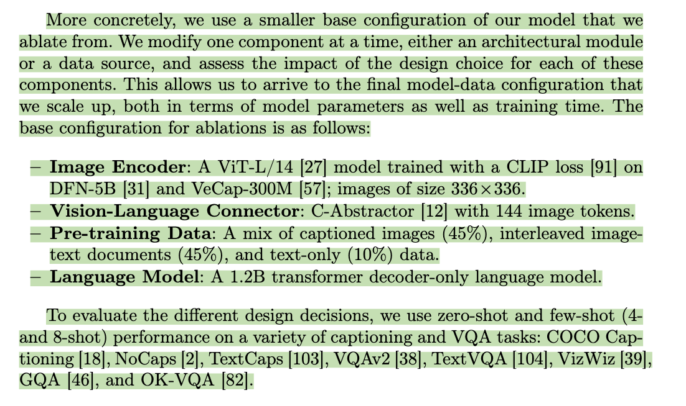
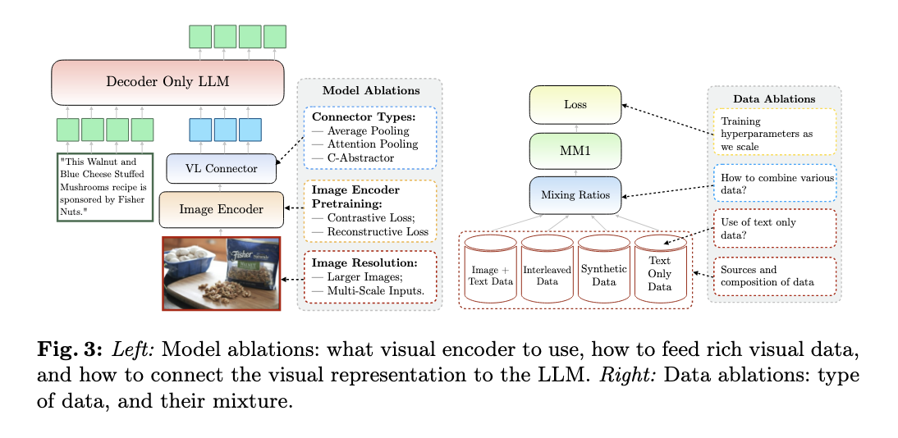

The article discusses Apple's MM1 multimodal large language model (MLLM), focusing on its architecture, training methods, and performance. MM1 integrates both visual and text data to enable tasks such as visual question answering (VQA), image captioning, and reasoning across multiple images. Key findings include:

1. **Architecture and Data Choices**: MM1 uses a mix of image-caption, interleaved image-text, and text-only data, which enhances its few-shot and zero-shot performance across various tasks. High image resolution and a mix of both dense and sparse (MoE) architectures improve task performance, especially when combining these data types.

2. **Model Variants**: MM1 includes models from 3B to 30B parameters, achieving state-of-the-art results on benchmarks like VQAv2 and OKVQA. MM1’s mixture-of-experts (MoE) models, with specialized expert layers, further scale up capabilities without significantly increasing inference costs.

3. **Performance and Applications**: The model excels in complex scenarios, such as understanding multi-image inputs and handling few-shot learning tasks. It also demonstrates in-context learning, meaning it can answer new questions by referencing examples provided in the prompt.

4. **Design Insights**: Key takeaways for building similar MLLMs include the importance of image resolution, the number of image tokens, and the use of diverse pre-training data to balance language and vision understanding.

Overall, MM1 provides a robust framework for multimodal tasks, outperforming other models on visual and textual benchmarks by optimizing data mixture, model size, and architectural choices. The model’s insights are expected to benefit future MLLM developments across various applications.

