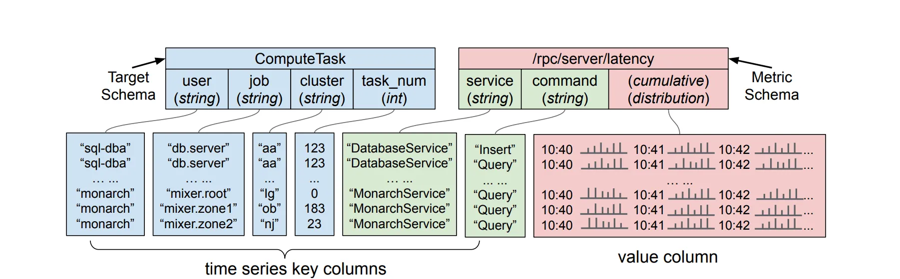
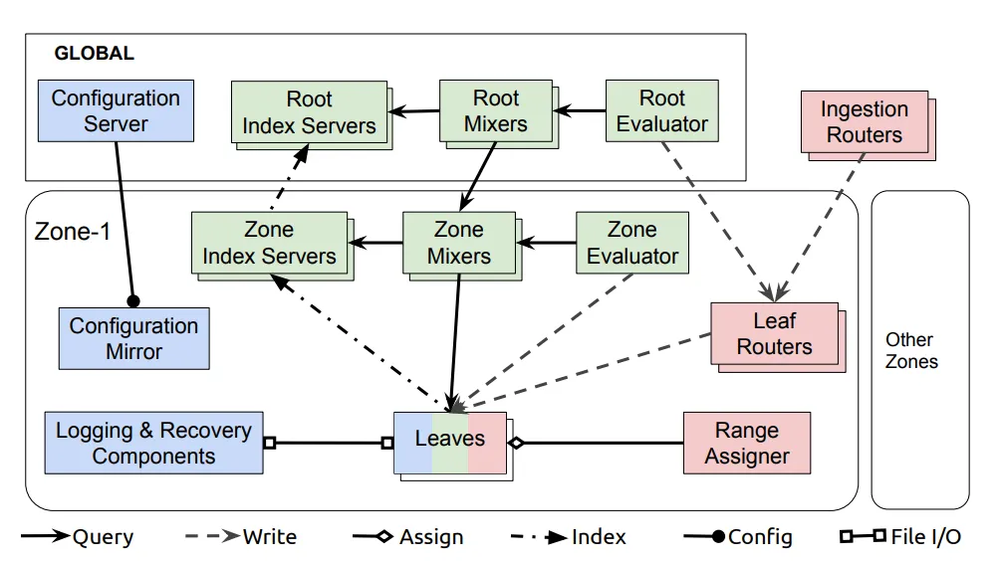
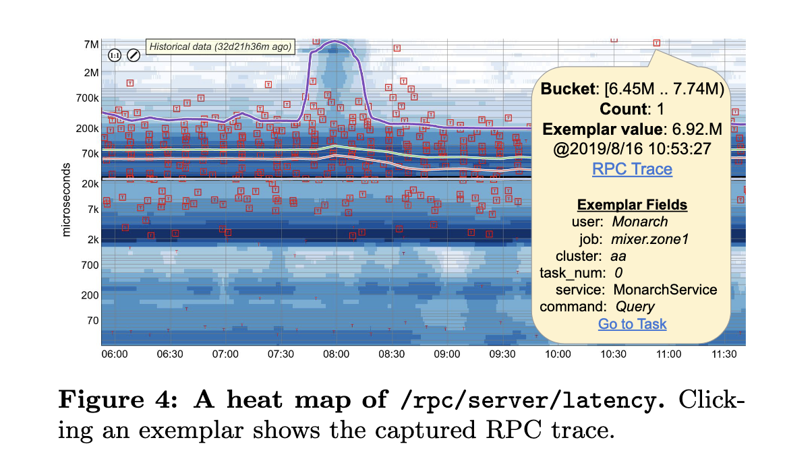
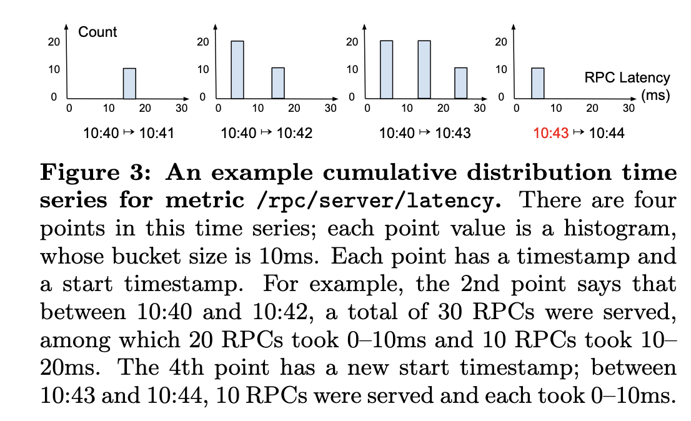
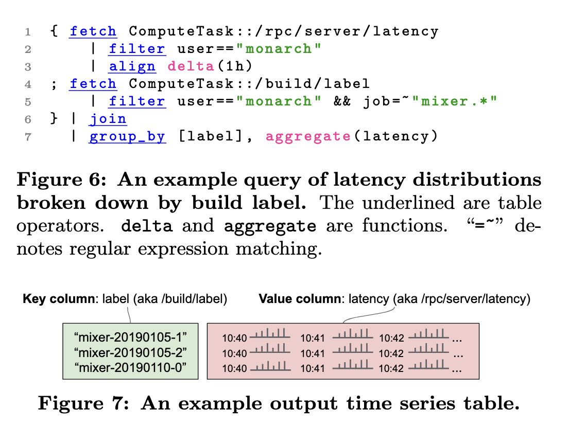

## HN discussion
https://news.ycombinator.com/item?id=31379383

The Hacker News discussion on [Monarch: Google’s Planet-Scale In-Memory Time Series Database](https://news.ycombinator.com/item?id=31379383) delves into the intricacies of time series database (TSDB) design, focusing on Monarch's approach to histogram storage and its implications for data analysis and monitoring.([Hacker News][1])

### Key Discussion Points

* **Monarch's Histogram Storage**: Unlike many TSDBs that generate histograms at query time using counter primitives, Monarch stores histograms as a fundamental data type. This design choice aims to improve performance but introduces challenges in flexibility and accuracy during analysis.([Hacker News][1])

* **Rebucketing Limitations**: Users highlight issues with Monarch's inability to rebucket histograms on the fly. This limitation can lead to misleading percentile calculations and artifacts in monitoring graphs, such as sudden jumps or plateaus, especially if the default bucket configurations are not well-suited to specific services.([Hacker News][1])

* **Alternative Solutions**: The discussion references Circonus Histograms, which employ a universal bucketing scheme to address some of these challenges. A co-author of a related paper [on arXiv](https://arxiv.org/abs/2001.06561) contributes insights into this approach.([Hacker News][1])

* **Prometheus Developments**: Participants mention that Prometheus is developing a sparse histogram feature intended to offer dynamic bucketing with minimal overhead. However, there are debates about whether this approach matches the flexibility of Monarch or Circonus.([Hacker News][1])

* **Practical Considerations**: The conversation also touches on the trade-offs between storage efficiency and analytical accuracy. Users discuss strategies for configuring bucket boundaries to align with business objectives and the challenges of maintaining precise monitoring without excessive resource consumption.

Overall, the thread provides a nuanced examination of TSDB design choices, emphasizing the balance between performance optimization and the need for accurate, flexible data analysis in large-scale monitoring systems.([Hacker News][1])

[1]: https://news.ycombinator.com/item?id=31379383&utm_source=chatgpt.com "Monarch: Google’s Planet-Scale In-Memory Time Series Database | Hacker News"

## Peter Kraft on Twitter

How do you keep track of every process running at Google? Countless quadrillions of metrics emitted by billions of devices and VMs?

This is a really cool paper that presents ten years of learnings from running Monarch, a planet-scale in-memory time series database that supports monitoring and alerting for much of Google’s applications and infrastructure. Monarch runs at massive scale, ingesting terabytes of data every second from billions of endpoints in datacenters across the globe, and needs incredible availability as it is a dependency of so many other Google services.

Monarch’s scale and availability requirements informed two critical design decisions: it must prioritize availability over consistency and it must store data in memory. This is because a system like Monarch is most critical when things are breaking–in the case of a network or file system outage, Monarch needs to do the best it can to deliver as much data as possible to the engineers trying to fix it, not get stuck trying to make sure all metrics are consistent and durable. Thus, reads may serve partial data and all writes are best-effort, including replication and flushes to durable storage.

To ingest terabytes of data every second, Monarch adopts a divide-and-conquer strategy. Incoming metrics are routed on multiple dimensions. First, they are routed based on location to a nearby collector. Then, they are lexicographically sharded based on their contents. Once a metric arrives at a Monarch server, it is stored in memory, then asynchronously (with best effort) written to recovery logs. To minimize the amount of data stored, particularly frequent metrics are aggregated during ingestion and only stored as cumulative series, not individual points.

Processing queries in Monarch is also difficult because they have to be globally distributed to get data from all the instances of a service. This is done hierarchically, by multiple levels of query processors that fan out queries across data centers and servers. Each processor level tries to push down work to the lower levels, so as much of the query as possible is evaluated directly on the data. To minimize the degree of fanout, the upper levels store an index of which of their children contain which ranges of data, to ensure queries aren’t sent to children that don’t have relevant data. To ensure availability, if some parts of the system are unresponsive, queries will return partial data.

What are the takeaways? What I found most interesting about Monarch is how it is designed to operate well during a catastrophe. Most databases prioritize strong consistency guarantees–if a query can’t be answered correctly (or data can’t be written durably), it isn’t answered at all. But Monarch needs to work even when everything else is broken, so at every level of its stack it prioritizes availability, getting as much data as possible to the engineers trying to fix a problem. That’s a valuable lesson–match your guarantees to what your users need!

## Summary

The paper titled **"Monarch: Google’s Planet-Scale In-Memory Time Series Database"** presents *Monarch*, a globally distributed, multi-tenant in-memory time series database developed and operated by Google to monitor its vast infrastructure and services. Below is a concise **outline of the key points and contributions**:

---

## **Key Points**

### **1. Motivation & Background**

* Google operates large-scale services like YouTube, Gmail, and infrastructure components like Spanner and Borg, which generate massive monitoring data.
* Monarch was developed to replace the older Borgmon system, which had significant limitations:

  * Operational complexity due to decentralization.
  * Lack of schema support and expressive queries.
  * Inadequate support for statistical value types (e.g., histograms).
  * Manual sharding and query evaluation limitations.

### **2. System Architecture**

* **Regionalized architecture**: Monarch zones are autonomous, regional subsystems that ingest and store data locally for fault tolerance.
* **Global query and configuration planes**: Provide a unified interface and centralized management across zones.
* **In-memory storage**: Chosen to avoid dependencies on persistent storage, crucial for reliable monitoring and low-latency alerts (see *Figure 1, page 2*).

### **3. Data Model**

* Monarch uses a **relational time series model** with:

  * **Targets**: Describe monitored entities (e.g., a task).
  * **Metrics**: Describe aspects like latency or resource usage.
  * Supports **rich value types**, including **distributions with exemplars** (e.g., Dapper traces), crucial for statistical analysis (see *Figures 2–4, pages 3–4*).

### **4. Data Collection and Ingestion**

* **Multi-tier ingestion pipeline**: Ingestion routers, leaf routers, and leaves.
* **Collection aggregation**: Efficiently aggregates high-volume data at ingestion time (e.g., for disk I/O metrics).
* **Intra-zone load balancing**: Uses target sharding for efficient ingestion and query execution.

### **5. Query System**

* Monarch features a **relational query language** with operations like `join`, `group_by`, `filter`, and `align` (see *Figure 6–7, page 6*).
* **Hierarchical distributed execution**: Queries are executed through root mixers, zone mixers, and leaves.
* **Pushdown optimizations**: Query operations are evaluated as close to data as possible (leaf → zone → root).
* **Field Hints Index (FHI)**: A compact index used to minimize query fanout (see *Section 5.4, page 8*).

### **6. Configuration System**

* A **centralized configuration plane** based on Spanner ensures consistent settings and schema updates across zones.
* Users can define custom schemas, retention policies, standing queries, and alerts.

### **7. Performance and Scale**

* As of 2019:

  * Ingested \~2.2 TB/s of time series data.
  * Stored \~950 billion time series using \~750 TB of memory.
  * Served over 6 million queries per second.
* Aggressive **query optimization and aggregation** reduce latency and improve scalability (see *Figures 8–12, pages 10–11*).

### **8. Lessons Learned**

* Lexicographic sharding improves ingestion/query performance.
* Push-based ingestion is simpler and more reliable than pull-based.
* Structured schemas enable query optimization.
* Operating as a multi-tenant service adds challenges in maintaining stability and performance.

---

## **Key Contributions**

1. **Architecture**: Description of a globally-distributed, in-memory, multi-tenant time series database.
2. **Data Model**: Introduction of a rich, schematized relational model supporting distribution types and exemplars.
3. **Scalability Innovations**:

   * Scalable ingestion pipeline with collection aggregation.
   * Field Hints Index for efficient query targeting.
   * Query execution optimizations with aggressive pushdown.
4. **Operational Insights**: Lessons from a decade of operation at planet-scale.

---

Let me know if you'd like a visual diagram or summary slide based on this content.

## A presentation about the Paper - from FOSDEM, not Google

https://av.tib.eu/media/52742

## Review Q&A 

Here are 5 thoughtful **review questions** with **answers** to help you recall and reflect on the key concepts from the *Monarch* paper:

---

### **1. What were the key limitations of Borgmon that led to the development of Monarch?**

**Answer:**

* Decentralized architecture required teams to manage their own instances, creating operational overhead.
* Lack of schema for metric dimensions led to ambiguous queries.
* No support for distribution (histogram) metric types, limiting statistical analysis.
* Manual sharding and limited support for cross-instance queries hindered scalability and usability.

---

### **2. How does Monarch’s regionalized architecture improve scalability and reliability?**

**Answer:**

* Each *Monarch zone* operates autonomously and stores data locally to reduce latency and avoid cross-region dependencies.
* Local ingestion and querying allow operation during regional or network failures.
* A *global query and configuration plane* unifies regional zones, enabling a coherent global system view.

---

### **3. What are the main components of Monarch’s data model, and how do they contribute to expressiveness in queries?**

**Answer:**

* **Targets** define the source entities (e.g., VMs, tasks) with key fields like cluster or user.
* **Metrics** define what is being measured (e.g., latency, memory usage) and support types like `int`, `double`, `distribution`.
* **Distributions with exemplars** allow efficient storage of histograms and deep debugging (e.g., tracing slow RPCs).
* The relational schema supports joins, grouping, and complex filtering, enabling expressive and optimized queries.

---

### **4. What role does the Field Hints Index (FHI) play in Monarch’s query system?**

**Answer:**

* FHI is a memory-resident, compact index of field value excerpts (e.g., trigrams) that reduces query fanout.
* It helps locate only the relevant zones, leaves, and targets for a query.
* Despite using fuzzy matching (allowing some false positives), it reduces fanout by 99.5% at the zone level and 80% at the root level, significantly improving performance.

---

### **5. How does Monarch support high-throughput, low-latency queries at massive scale?**

**Answer:**

* **Query pushdown** executes operations as close to the data as possible (leaf → zone → root).
* **Standing queries** precompute frequent or alerting queries for fast access.
* **Hierarchical execution** with mixers and evaluators balances load.
* **Collection aggregation** reduces data volume at ingestion.
* Techniques like **hedged reads** and **replica resolution** ensure reliable results even under partial failures.

---

Let me know if you’d like to turn these into an Anki flashcard format or create more questions!

