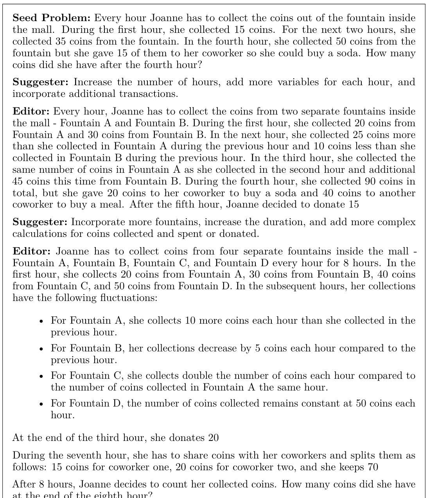
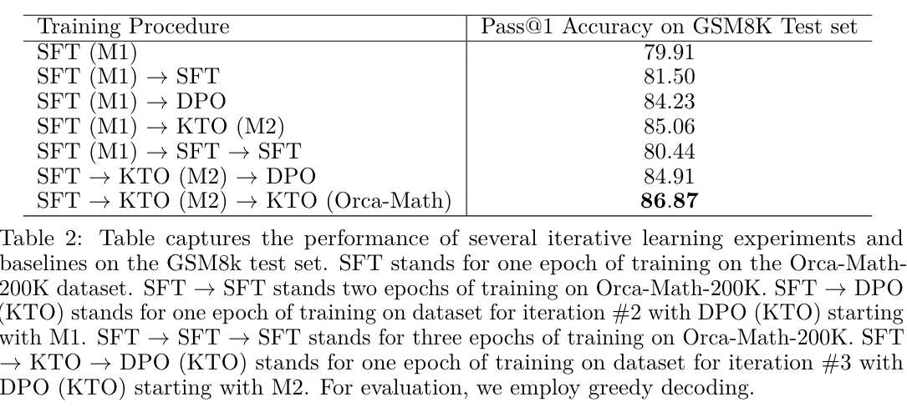

This article presents "Orca-Math", a 7-billion-parameter small language model (SLM) that achieves impressive performance on grade school math problems, specifically the GSM8K benchmark. Here are the key points:

1. Performance: Orca-Math achieves 86.81% accuracy on GSM8K without using multiple model calls, verifiers, code execution, or external tools. This surpasses the performance of much larger models like LLAMA-2-70B and ChatGPT-3.5.

2. Data: The model is trained on only 200K synthetic math problems, which is significantly less data than used by other models.

3. Methodology:
   - Dataset creation: Uses a multi-agent setup called "Agent-Instruct" to generate diverse and challenging problems.
   - Training: Employs an iterative learning technique with three main steps:
     a) Supervised fine-tuning on demonstrations
     b) Allowing the model to practice generating multiple solutions
     c) Using a teacher model (GPT-4-Turbo) to provide feedback

4. Key innovations:
   - Use of both positive and negative feedback in training
   - Incorporation of model-generated positive examples in training data
   - Iterative learning approach

5. Results: The model shows strong performance not just on GSM8K but also on other math word problem datasets like AddSub, ASDiv, MultiArith, etc.

6. Significance: This work demonstrates that SLMs can achieve high performance on complex reasoning tasks with relatively small amounts of high-quality data and innovative training techniques.

7. Future implications: The study suggests potential for further improvements in SLM performance through iterative learning and self-improvement strategies in challenging domains.

## Dataset creation - suggester, editor

The dataset generation process for Orca-Math involves several steps:

1. Seed Set Creation:
   - Collected 36,217 problems from various open-source math datasets.

2. "Ask Me Anything" Agent:
   - Expanded the seed set by creating multiple variations of each problem.
   - Generated 120,445 new problems.

3. Suggester & Editor Agents:
   - Suggester: Proposed methods to increase problem complexity.
   - Editor: Created updated, more challenging problems based on suggestions.
   - This iterative process occurred over two rounds.
   - Collected 37,157 problems after filtering.

4. DMath Integration:
   - Included 6,216 problems from the DMath dataset.
   - Selected problems where GPT4-Turbo's solution matched the gold standard answer.

5. Final Dataset:
   - Combined all generated problems to create the Orca-Math-200K dataset.

6. Solution Generation:
   - Used GPT4-Turbo to generate solutions for all problems in the dataset.

This multi-step process aimed to create a diverse set of grade school math problems, ranging from easy to challenging, using a combination of existing problems, AI-generated variations, and human-curated datasets.

## Contributions

This paper makes several key contributions in the space of Small Language Models (SLMs):

1. Performance breakthrough: It demonstrates that a 7B parameter model can achieve over 86% accuracy on GSM8K, surpassing the previously perceived 80% barrier for SLMs on this benchmark. This challenges the notion that only very large models can excel at complex reasoning tasks.

2. Efficient training with limited data: The model achieves high performance using only 200K synthetic problems, which is significantly less data than used by many other approaches. This shows the potential of high-quality, targeted datasets for training SLMs.

3. Innovative data generation: The paper introduces "Agent-Instruct," a multi-agent setup for creating diverse and challenging math problems. This method could potentially be applied to other domains for generating high-quality training data.

4. Iterative learning approach: The study presents a novel three-step iterative learning technique that combines supervised fine-tuning, practice generation, and feedback incorporation. This approach could be valuable for training SLMs in other complex domains.

5. Effective use of feedback: The paper demonstrates the benefits of using both positive and negative feedback in training, as well as incorporating model-generated positive examples. This contributes to our understanding of how to effectively train SLMs.

6. Comparison of learning algorithms: The study provides insights into the relative effectiveness of different preference learning algorithms (DPO vs. KTO) in this context.

7. Generalization to other math tasks: The model's strong performance across various math word problem datasets suggests that the approach generalizes well beyond just GSM8K.

8. Challenging scale requirements: This work questions the assumption that extremely large models are necessary for complex reasoning tasks, potentially opening up new avenues for more efficient and accessible AI development.

These contributions collectively advance our understanding of how to create more capable SLMs, potentially making advanced AI capabilities more accessible and efficient to deploy.

## Q & A

Certainly! Here are 5 questions with answers to help you review the key points of this article:

1. Q: What is the main achievement of Orca-Math in terms of GSM8K benchmark performance?
   A: Orca-Math achieves 86.81% accuracy on GSM8K without using multiple model calls, verifiers, code execution, or external tools.

2. Q: How many parameters does Orca-Math have, and how does its performance compare to larger models?
   A: Orca-Math is a 7-billion-parameter model that outperforms significantly larger models such as LLAMA-2-70B, WizardMath-70B, and ChatGPT-3.5.

3. Q: What is the "Agent-Instruct" setup mentioned in the paper, and what is its purpose?
   A: Agent-Instruct is a multi-agent setup used for creating diverse and challenging math problems. It involves agents like Suggester and Editor that collaborate to generate and refine problems for the dataset.

4. Q: How many synthetic math problems were used to train Orca-Math, and why is this significant?
   A: Orca-Math was trained on only 200K synthetic math problems. This is significant because it's much smaller than the datasets used by many other models, demonstrating the efficiency of the approach.

5. Q: What are the three main steps in the iterative learning technique used to train Orca-Math?
   A: The three main steps are: 1) Supervised fine-tuning on demonstrations, 2) Allowing the model to practice generating multiple solutions, and 3) Using a teacher model (GPT-4-Turbo) to provide feedback on the solutions.

These questions cover the model's performance, architecture, dataset generation, training data size, and training methodology, which are key aspects of the research presented in this article.
