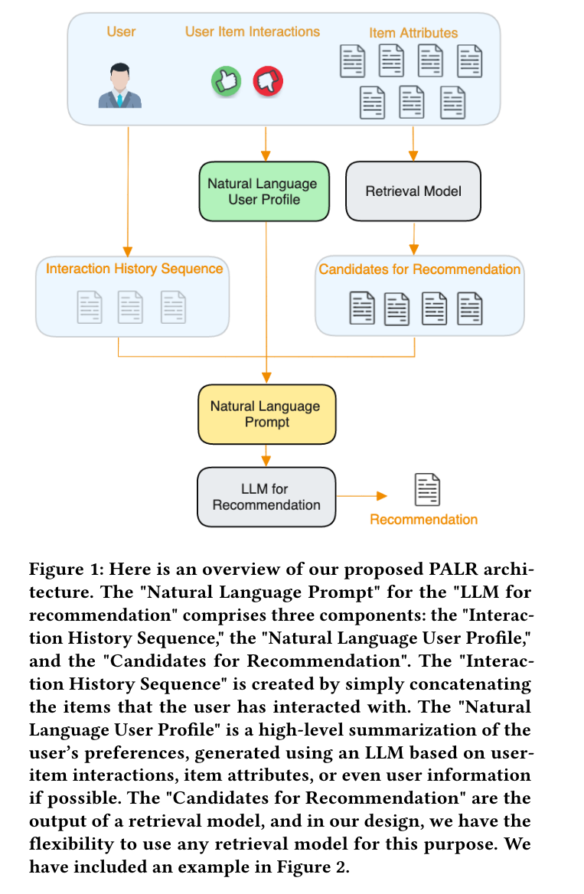
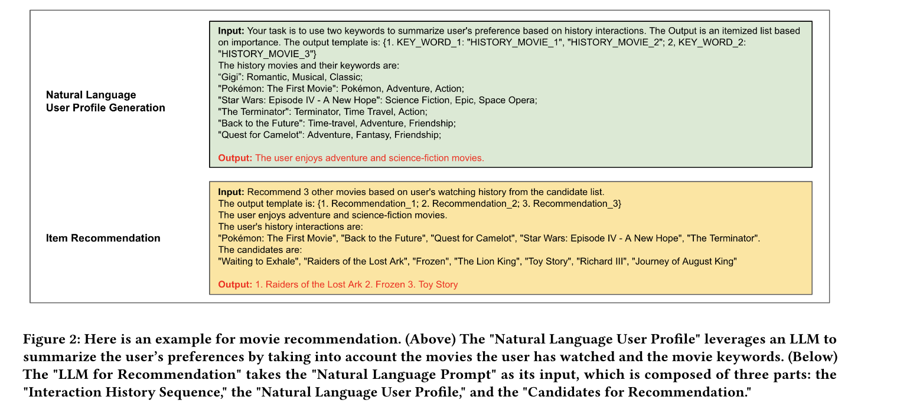

The article introduces the PALR (Personalization Aware LLMs for Recommendation) framework designed to enhance recommender systems by integrating user behavioral data with large language models (LLMs). PALR aims to personalize recommendations by analyzing user interactions like clicks and purchases and using this data to generate user profiles. These profiles guide the retrieval of candidate items, which are then ranked by an LLM to provide recommendations.

The framework operates in multiple steps:
1. **User Profile Generation**: It uses LLMs to generate a natural language summary of a user’s preferences based on their interaction history.
2. **Candidates Retrieval**: A retrieval module filters out irrelevant candidates to ensure that only pertinent options are considered for recommendation.
3. **Item Recommendation**: The LLM recommends items by creating a prompt that includes the user’s profile and the filtered candidates, leveraging the model's reasoning abilities.

PALR employs instruction-based fine-tuning with a focus on making the LLM adept at handling specific recommendation tasks. It was evaluated using two public datasets, demonstrating significant improvement over state-of-the-art models in recommendation tasks.

The paper highlights the advantage of using LLMs in recommendation systems due to their ability to incorporate diverse data types and provide explainable outputs, enhancing user trust. Future research will focus on optimizing LLM performance in recommendation settings, balancing computational demands with accuracy and personalization.

Here are five questions and answers to help review the key concepts of the article on the PALR framework:

1. **What is the primary goal of the PALR framework?**
   - **Answer:** The primary goal of the PALR framework is to integrate user behavior data with large language models (LLMs) to generate personalized recommendations in recommender systems.

2. **How does PALR use LLMs differently than traditional recommender systems?**
   - **Answer:** Unlike traditional recommender systems that might use static algorithms or embeddings, PALR uses LLMs to dynamically generate user profiles and recommendations based on natural language summaries of user behaviors. This allows for the integration of various data signals and more adaptable, personalized recommendations.

3. **What are the three main steps in the PALR recommendation process?**
   - **Answer:** The three main steps in the PALR process are:
      1. User Profile Generation: Generating a natural language summary of user preferences based on interaction history.
      2. Candidates Retrieval: Filtering out irrelevant items to streamline the recommendation pool.
      3. Item Recommendation: Using an LLM to recommend items from the filtered pool based on the user’s profile and historical interactions.

4. **What benefits do LLMs provide in the PALR framework that traditional methods lack?**
   - **Answer:** LLMs in the PALR framework offer several advantages, such as the ability to incorporate multi-modal data, provide explanations for recommendations which enhance user trust, and adapt to new items without the need for retraining the model extensively.

5. **What were the key findings from the evaluations of the PALR framework on public datasets?**
   - **Answer:** The evaluations on public datasets like MovieLens-1M and Amazon Beauty demonstrated that the PALR framework significantly outperforms traditional and state-of-the-art models, particularly in terms of accuracy and personalization in recommendations. This showcases the framework's effective use of LLMs in generating relevant and personalized item suggestions.
