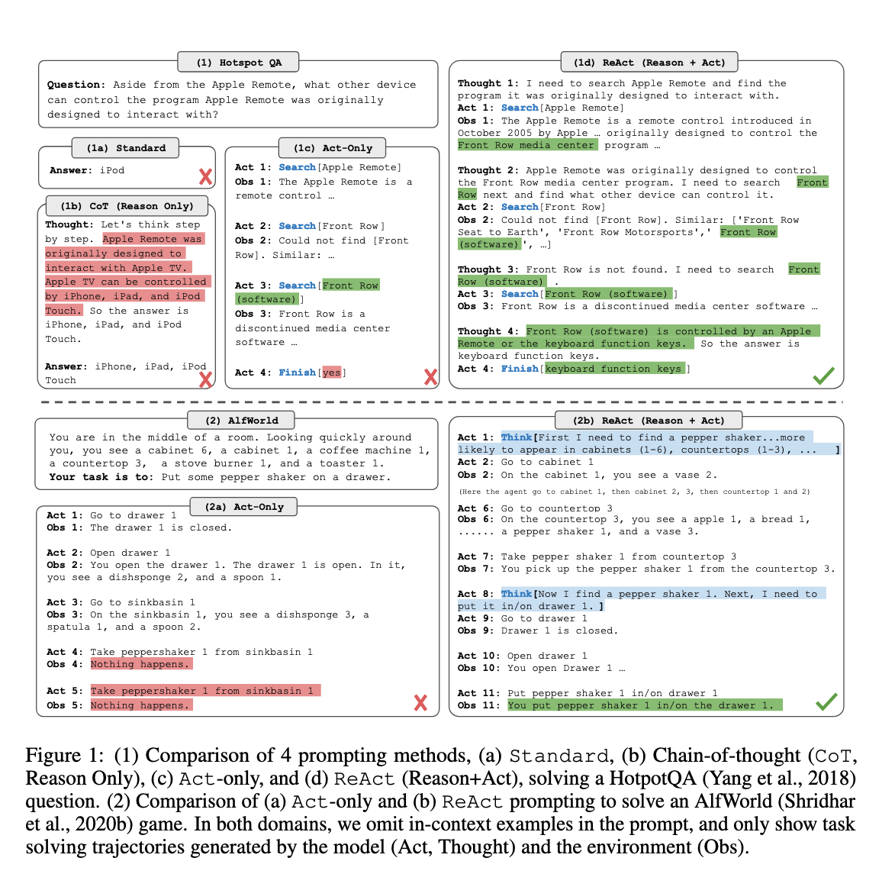

The paper, titled **"ReAct: Synergizing Reasoning and Acting in Language Models"**, presents a new approach for large language models (LLMs) called "ReAct," which aims to integrate reasoning and action generation into a unified system. 

### Key Insights:
- **Problem**: Traditionally, reasoning (such as chain-of-thought) and acting (such as generating task-specific actions) are studied separately. However, real-world tasks require a combination of both reasoning and acting to efficiently solve problems.
  
- **ReAct Approach**: The ReAct framework interleaves reasoning traces and task-specific actions, where reasoning helps in tracking and updating plans, while actions involve interacting with environments (like querying knowledge bases). This interleaving of actions and reasoning leads to dynamic decision-making.
  
- **Benefits**: ReAct improves performance on tasks requiring knowledge retrieval and decision-making, such as question answering (HotpotQA) and fact verification (Fever). It also enhances human interpretability of the model's behavior by making the thought process and actions transparent.

- **Empirical Results**: The approach is tested on several benchmarks like HotpotQA, Fever, ALFWorld, and WebShop, showing improvements in accuracy, generalization, and success rates compared to state-of-the-art models.

- **Interpretability and Trustworthiness**: By combining reasoning with actions, ReAct generates more interpretable decision paths, making it easier for humans to inspect and intervene if necessary.

In summary, ReAct improves both reasoning and acting capabilities of LLMs by tightly coupling them in a feedback loop, yielding better performance and interpretability in complex tasks.

## Main contributions

The main contributions of the **ReAct** paper are:

1. **Introduction of ReAct Framework**: The paper proposes a novel paradigm that combines reasoning and acting in language models, enabling them to generate both reasoning traces and task-specific actions in an interleaved manner. This synergy allows for dynamic reasoning and action updating, improving decision-making capabilities.

2. **Empirical Validation**: The ReAct approach is extensively evaluated on a diverse set of benchmarks:
   - **HotpotQA** (for question answering),
   - **Fever** (for fact verification),
   - **ALFWorld** (a text-based game),
   - **WebShop** (web navigation and online shopping).
   
   ReAct shows significant improvements over baseline models that use reasoning or acting alone.

3. **Improved Performance on Decision-Making Tasks**: On interactive decision-making tasks like ALFWorld and WebShop, ReAct outperforms imitation and reinforcement learning methods, achieving up to 34% and 10% higher success rates, respectively, while being prompted with only a few in-context examples.

4. **Enhanced Interpretability and Trustworthiness**: By interleaving reasoning and actions, ReAct generates human-like task-solving trajectories that make the decision-making process more interpretable and transparent. This helps mitigate issues like hallucination and error propagation in reasoning tasks.

5. **Scalability and General Applicability**: The ReAct framework is general enough to work across different domains, including question answering, fact verification, and interactive decision making. The model can also be fine-tuned for further performance gains.

6. **Human Alignment and Controllability**: ReAct improves human alignment by allowing the reasoning process to be inspected and edited during task execution, enabling human users to guide the model's behavior more effectively.

These contributions demonstrate that combining reasoning and acting in LLMs results in better task-solving capabilities, human interpretability, and performance across various complex tasks.

## ReAct prompting

**ReAct prompting** is a novel approach proposed in the paper that enables large language models (LLMs) to perform both **reasoning** and **acting** in a unified, interleaved manner. The idea behind ReAct is to prompt the model to generate reasoning traces (thoughts) and actions alternately as part of its task-solving process, rather than treating them as separate or isolated processes.

Here’s a breakdown of how ReAct prompting works:

### Key Components of ReAct Prompting:
1. **Reasoning Traces (Thoughts)**:
   - The model generates explicit reasoning steps, which explain its thought process for decomposing the task, updating plans, or making decisions.
   - These thoughts guide the next action by synthesizing information, applying commonsense knowledge, and planning the next steps based on the current state.
   
2. **Actions**:
   - After generating a reasoning trace, the model generates an action that interacts with the environment (e.g., querying an external API, looking up information, or moving to the next subtask).
   - The actions are influenced by the model’s reasoning and often involve retrieving new information from external sources or environments (e.g., searching Wikipedia, navigating a webpage).
   
3. **Observations**:
   - After an action is performed, the model receives feedback from the environment in the form of observations. These observations help the model adjust its reasoning and decide on the next action or thought.
   
4. **Interleaving Thoughts and Actions**:
   - In ReAct prompting, thoughts and actions are generated in an interleaved manner. For example, a typical ReAct sequence might look like:
     1. **Thought**: "I need to search for the term X to find more information."
     2. **Action**: Perform the search for X.
     3. **Observation**: The search results provide information about X.
     4. **Thought**: "Now that I have found information on X, I need to check Y next."
     5. **Action**: Perform a new search for Y, etc.
   
### Example of ReAct Prompting:
In the paper, a multi-step question-answering task (e.g., HotpotQA) might be approached with ReAct prompting as follows:
- **Question**: "What is the elevation range for the area that the eastern sector of the Colorado orogeny extends into?"
- **ReAct Prompt**:
   - **Thought**: "I need to search for information on the Colorado orogeny to find the eastern sector."
   - **Action**: Search for "Colorado orogeny."
   - **Observation**: "The Colorado orogeny was an episode of mountain building in Colorado."
   - **Thought**: "It doesn't mention the eastern sector. I need to search for the eastern sector of the orogeny."
   - **Action**: Search for "eastern sector of Colorado orogeny."
   - **Observation**: "The eastern sector extends into the High Plains."
   - **Thought**: "Now I need to check the elevation range of the High Plains."
   - **Action**: Search for "High Plains elevation range."
   - **Observation**: "The High Plains rise in elevation from around 1,800 to 7,000 ft."
   - **Final Thought**: "The elevation range is 1,800 to 7,000 ft."
   - **Action**: Finish the task with the answer "1,800 to 7,000 ft."

### Why ReAct is Effective:
1. **Dynamic Reasoning and Acting**: By combining thoughts and actions, ReAct enables models to adapt their reasoning based on real-time feedback (observations) from the environment, making the model more flexible and less prone to error propagation.
   
2. **Grounded Problem Solving**: The actions help ground the model’s reasoning in real-world information (e.g., querying a knowledge base like Wikipedia), which helps avoid hallucinations or incorrect inferences.

3. **General Applicability**: ReAct prompting works for various types of tasks, such as question answering, fact verification, interactive decision-making (e.g., in games), and web navigation.

In summary, **ReAct prompting** enables LLMs to reason and act in a synergistic manner, improving performance on complex tasks by integrating dynamic reasoning with interactive actions.

## Difference between CoT and ReAct

The key difference between **Chain-of-Thought (CoT)** prompting and **ReAct** prompting lies in how they handle reasoning and action generation in the context of solving tasks:

### 1. **Reasoning Only (CoT)**:
   - **CoT** focuses purely on reasoning. The model generates a sequence of logical steps (thoughts) to solve the task without performing any actions or interacting with external sources.
   - **How it works**: The model is prompted to produce intermediate reasoning steps in a structured, step-by-step manner. These reasoning steps are generated using the model’s internal knowledge to arrive at a final answer. 
   - **Limitations**: Since CoT relies solely on the model’s internal knowledge, it is prone to issues like hallucination (i.e., generating incorrect but plausible-sounding reasoning) or being unable to adapt when the information needed to solve the task is not available internally.

   **Example**:
   - **Task**: "What is the population of Paris?"
   - **CoT Response**: 
     - **Thought 1**: "Paris is the capital of France."
     - **Thought 2**: "The population of Paris is likely to be in the range of a few million."
     - **Answer**: "The population of Paris is around 2.1 million."

### 2. **Reasoning and Acting (ReAct)**:
   - **ReAct** combines reasoning (thoughts) with actions, allowing the model to interact with external environments (e.g., search engines, APIs) to retrieve information and update its plans dynamically based on observations from those actions.
   - **How it works**: In ReAct, reasoning traces (thoughts) are interleaved with actions. The model generates reasoning steps to decide what actions to take (e.g., searching for specific information, retrieving facts), performs the actions, receives feedback (observations), and then uses the new information to adjust its next steps. 
   - **Advantages**: ReAct can dynamically retrieve additional information from external sources, making it more robust in scenarios where the model’s internal knowledge is insufficient or outdated. This ability to act and update reasoning based on real-time feedback reduces the likelihood of hallucination and improves task performance.
   
   **Example**:
   - **Task**: "What is the population of Paris?"
   - **ReAct Response**:
     - **Thought 1**: "I need to search for the population of Paris."
     - **Action**: Perform a search for "Paris population."
     - **Observation**: "The population of Paris is around 2.1 million."
     - **Final Thought**: "Based on this, the answer is 2.1 million."
     - **Answer**: "The population of Paris is 2.1 million."

### **Detailed Comparison**:

| Feature                  | **Chain-of-Thought (CoT)**                         | **ReAct**                                           |
|--------------------------|---------------------------------------------------|----------------------------------------------------|
| **Reasoning**             | Focuses on reasoning using only internal knowledge | Combines reasoning with actions (interactions)     |
| **Actions**               | No actions—only generates reasoning traces         | Alternates between reasoning and actions (searching, retrieving) |
| **Source of Knowledge**   | Relies solely on the model's internal knowledge     | Can retrieve new information from external sources (e.g., API queries, databases) |
| **Handling of Observations** | Does not handle observations or real-time feedback  | Incorporates feedback from the environment (e.g., search results, API responses) |
| **Risk of Hallucination** | Higher—since it relies only on internal reasoning  | Lower—can query external sources to verify or retrieve facts |
| **Task Applicability**    | Suitable for tasks that require pure reasoning     | Suitable for tasks requiring both reasoning and interaction with external environments |
| **Examples of Tasks**     | Math problems, logical puzzles, trivia             | Question answering, fact verification, interactive decision-making, web navigation |

### **Strengths of CoT**:
- Works well for tasks where the model’s internal knowledge is sufficient, like arithmetic reasoning, commonsense reasoning, and step-by-step logical deductions.
- Straightforward and simpler prompting structure that only involves reasoning.

### **Strengths of ReAct**:
- More flexible and adaptable, especially for tasks requiring external information retrieval, real-time decision-making, or multi-step processes involving dynamic updates.
- Reduces hallucination risks by grounding reasoning in external data, making the model’s behavior more interpretable and trustworthy.

### When to Use Each:
- **CoT** is ideal when the task can be solved entirely using the model's internal knowledge and logical deductions (e.g., solving puzzles, performing arithmetic calculations).
- **ReAct** is preferable for tasks where reasoning alone is insufficient, and the model needs to interact with external information or environments (e.g., fact-checking, web browsing, or multi-step decision-making tasks).

In summary, **CoT** focuses on internal reasoning, while **ReAct** integrates reasoning with actions and environmental feedback, making it more powerful for complex, interactive tasks.

## Baselines

In the **ReAct** paper, several baseline models are used for comparison across different tasks to evaluate the effectiveness of the proposed framework. These baselines are designed to either focus on reasoning alone (like chain-of-thought prompting) or acting alone (like generating actions in isolation). Here are the key baselines mentioned:

### 1. **Standard Prompting (Standard)**:
   - This baseline removes all thoughts, actions, and observations in the ReAct prompt. It represents a typical language model task setup without explicit reasoning or action generation.
   
### 2. **Chain-of-Thought Prompting (CoT)**:
   - This is a **reasoning-only** baseline, where the model generates reasoning traces (thoughts) but no actions or interactions with external environments. This baseline is commonly used to perform multi-step reasoning tasks (like arithmetic or commonsense reasoning).
   - **CoT-SC** (Self-Consistency): An enhanced version of chain-of-thought reasoning where multiple reasoning paths (21 samples) are generated, and the final answer is determined based on a majority vote (self-consistency). This technique helps improve accuracy.

### 3. **Acting-Only Prompting (Act)**:
   - This baseline removes the reasoning traces from the ReAct prompt, so the model only generates actions without any reasoning. It simulates setups like **WebGPT** where the model interacts with an environment (e.g., web browsing) to perform actions but lacks explicit reasoning steps.

### 4. **Imitation Learning (IL)** and **Imitation + Reinforcement Learning (IL + RL)**:
   - These baselines are used for comparison in decision-making tasks like **ALFWorld** and **WebShop**. They represent models trained via imitation learning (IL) from human demonstrations and combined imitation + reinforcement learning (IL + RL), which trains the model on a large number of task instances.
   
### 5. **BUTLER (for ALFWorld)**:
   - This is an **imitation learning agent** trained on a large number of expert trajectories (105 per task type) for embodied decision-making tasks in ALFWorld. It is used to benchmark ReAct's performance in interactive tasks.

### Combined Approaches:
- The authors also test **combinations of ReAct and CoT-SC**, such as:
  - **ReAct → CoT-SC**: If ReAct fails to return an answer within a given number of steps, it falls back to CoT-SC.
  - **CoT-SC → ReAct**: When CoT-SC fails to confidently predict an answer (based on low self-consistency), the model backs off to ReAct.

### Summary of Baselines:
- **Reasoning-only models** (CoT, CoT-SC) focus on internal reasoning without action.
- **Action-only models** (Act, IL, IL + RL) focus on generating actions without reasoning.
- **Combined approaches** (like ReAct → CoT-SC) integrate both reasoning and acting.

ReAct is shown to outperform these baselines by leveraging both reasoning and actions in an interleaved manner, leading to better performance across diverse tasks.
