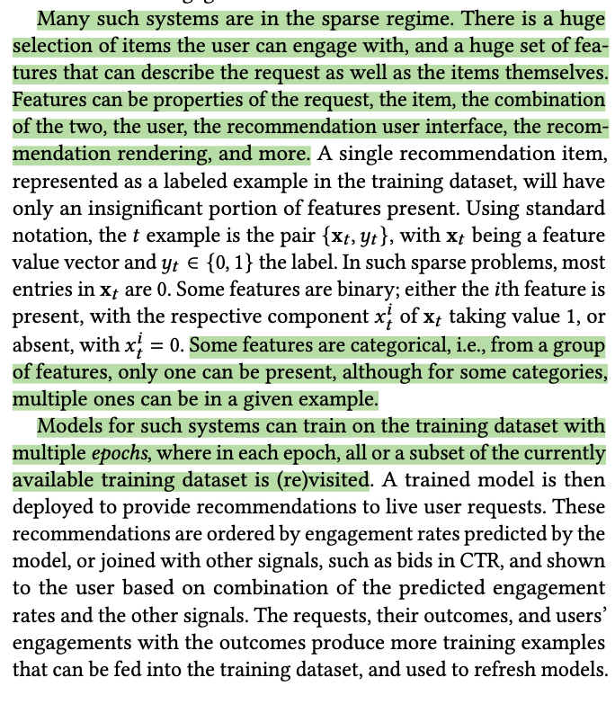
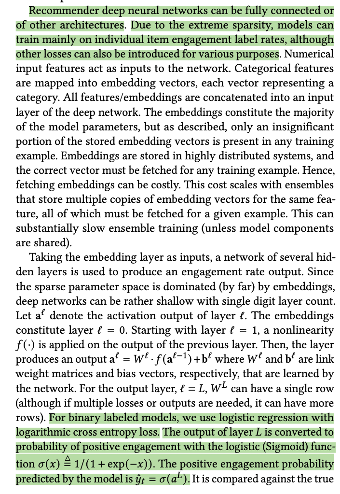
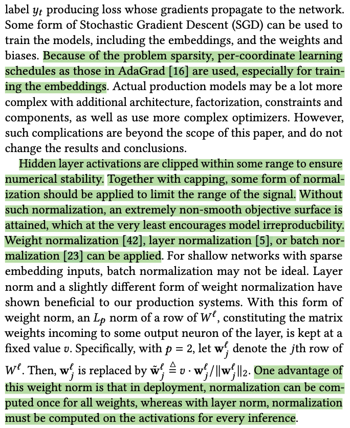
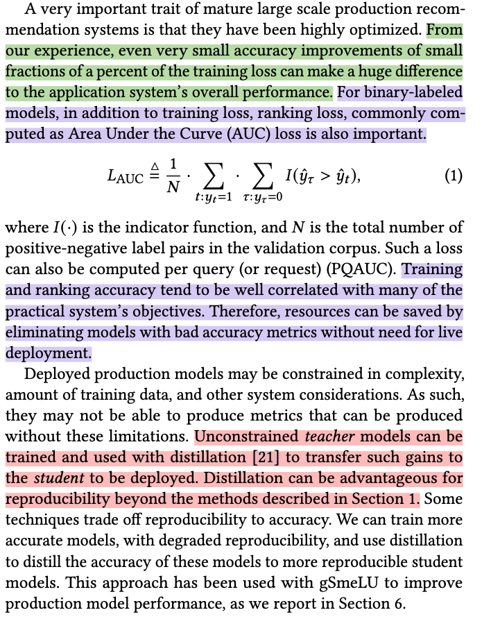
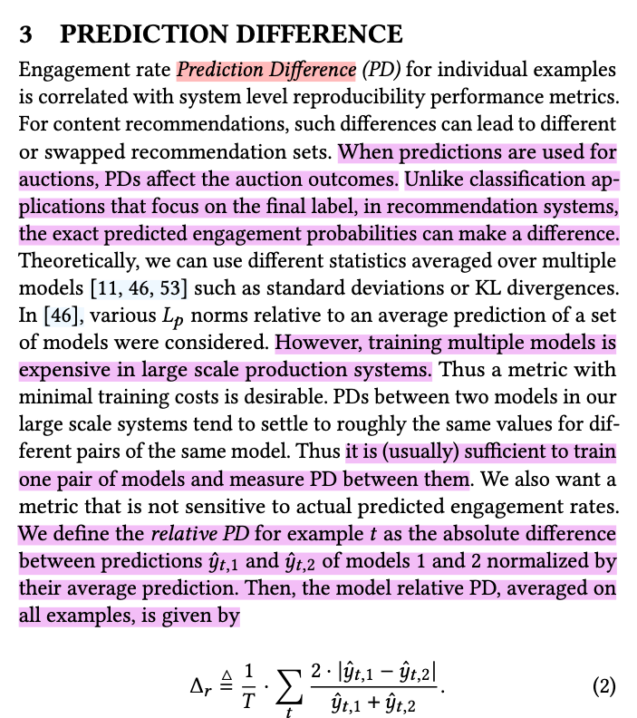

The paper titled *"Real World Large Scale Recommendation Systems Reproducibility and Smooth Activations"* by Gil I. Shamir and Dong Lin focuses on the problem of irreproducibility in large-scale recommendation systems that rely on deep learning models. 

Key points include:

- **Reproducibility Challenges**: In real-world recommendation systems, identical requests can yield different results due to irreproducibility in deep models. This issue, underexplored in research, impacts both user experience and engineering workflows. Irreproducibility can lead to different outcomes even when using the same system and data, which is particularly problematic in applications like job recommendations or medical diagnosis.

- **Role of ReLU**: The paper identifies the Rectified Linear Unit (ReLU) activation function as a significant contributor to irreproducibility. Due to ReLU's non-smooth nature, it leads to non-convex optimization landscapes, where small variations during training cause models to converge to different optima, even when the same data and configuration are used.

- **Smooth Activations (SmeLU)**: To address this, the authors propose using smooth activation functions, specifically Smooth ReLU (SmeLU), which has a simpler mathematical form and offers better reproducibility without sacrificing accuracy. Unlike traditional techniques, smooth activations improve reproducibility and can even enhance prediction accuracy in recommendation systems.

- **Production Implementation**: The authors report successful deployment of SmeLU in real-world systems, such as click-through-rate (CTR) prediction and content recommendation systems. SmeLU led to substantial improvements in both reproducibility and accuracy, as well as reduced system complexity and faster training times.

The paper highlights the importance of balancing accuracy and reproducibility, particularly in large-scale systems, and presents smooth activations as an effective solution to improve both metrics.

## Important considerations

## SmeLU

According to the paper *"Real World Large Scale Recommendation Systems Reproducibility and Smooth Activations,"* the primary benefits of using other activation functions, particularly **smooth activations** like **Smooth ReLU (SmeLU)**, are centered around improving **reproducibility** in large-scale recommendation systems without sacrificing accuracy. Below are the key benefits highlighted in the paper:

### 1. **Improved Reproducibility**
   - **ReLU’s Issue**: The paper identifies that the widely used ReLU activation function leads to irreproducibility in deep learning models due to its non-smooth nature. ReLU's sharp transitions in its gradient cause models to converge to different local minima, leading to inconsistent predictions across training runs, even with identical data and configurations.
   - **Smooth Activation Benefit**: Smooth activations like **SmeLU** mitigate this issue by providing smoother transitions, which reduce the sensitivity of the model to small changes during training. As a result, the models become more **reproducible**, generating more consistent outputs for the same inputs across multiple training runs. This is crucial in real-world systems where unpredictable results can negatively impact user experience and the development cycle.

### 2. **Maintaining or Improving Accuracy**
   - **ReLU’s Trade-off**: While ReLU is known for yielding good accuracy, addressing its irreproducibility often comes at the cost of reduced accuracy when using certain techniques.
   - **Smooth Activation Benefit**: According to the paper, **smooth activations** such as **SmeLU** not only improve reproducibility but can also **maintain or even enhance accuracy** compared to ReLU. This is because smooth activations provide a more stable training landscape, allowing models to converge more reliably to optimal solutions. In the case of SmeLU, the authors report accuracy gains in some production systems, such as improvements in click-through-rate (CTR) prediction systems.

### 3. **Better Accuracy-Reproducibility Trade-Off**
   - **ReLU’s Issue**: The paper highlights that many traditional techniques for improving reproducibility (like regularization or dropout) often degrade the accuracy of models, making them undesirable for large-scale production systems.
   - **Smooth Activation Benefit**: Smooth activations, particularly **SmeLU**, offer a **superior trade-off between accuracy and reproducibility**. The paper shows that SmeLU enables models to achieve both high accuracy and reproducibility without the trade-offs typically seen with other methods. This makes smooth activations ideal for recommendation systems, where maintaining high accuracy is critical for system performance.

### 4. **Simplified Mathematical Form and Cheaper Implementation**
   - **Complex Alternatives**: Other smooth activations, such as **Swish** and **GELU**, offer smoother transitions than ReLU, but they are mathematically more complex and computationally more expensive to implement.
   - **SmeLU’s Benefit**: The authors propose **SmeLU** as a simpler, more mathematically efficient alternative that still provides the benefits of smoothness. This simplicity leads to **cheaper implementations** in terms of both computational costs and ease of deployment. SmeLU achieves competitive performance to more complex smooth activations without the overhead of complex computations, which is beneficial in large-scale systems with resource constraints.

### 5. **Reduced Prediction Differences (PD)**
   - **ReLU’s Issue**: The paper notes that models using ReLU often exhibit high **Prediction Differences (PDs)**—the difference in predicted outcomes between two models trained with the same data and configuration. This can lead to undesirable variability in real-world systems.
   - **Smooth Activation Benefit**: Smooth activations, particularly **SmeLU**, significantly **reduce PDs** compared to ReLU. Lower PDs mean that the model's predictions become more stable and less sensitive to small perturbations during training, leading to better user experience and fewer discrepancies in model evaluations during A/B testing or production.

### 6. **Practical Benefits in Large-Scale Production Systems**
   - **Real-World Use Cases**: The paper provides examples of deploying **SmeLU** in various large-scale recommendation systems, including CTR prediction and content recommendation systems. These deployments showed:
     - **55% reduction in PD** in one system, with no loss of accuracy.
     - **Training speed improvements** (e.g., 33% faster) due to the elimination of the need for ensemble models.
     - **Substantial system performance improvements** due to more consistent and reproducible predictions.

### 7. **Customization via Generalized Smooth Activations (gSmeLU)**
   - **ReLU’s Limitation**: ReLU offers a fixed behavior that cannot be tuned to specific system requirements.
   - **gSmeLU’s Benefit**: The paper introduces **Generalized SmeLU (gSmeLU)**, a flexible extension of SmeLU that allows further customization of the activation function. This flexibility enables the activation to be tailored to different parts of the network or different tasks within a system, optimizing both accuracy and reproducibility based on the specific needs of the system.

### 8. **Improved Training Efficiency**
   - **ReLU’s Inefficiency**: In large-scale systems, especially those that require continuous training or retraining, irreproducibility can lead to wasted resources as engineers struggle to diagnose and fix inconsistencies between training runs.
   - **Smooth Activation Benefit**: The paper reports that by using smooth activations, particularly SmeLU, systems experienced **faster convergence** during training and **improved training efficiency**. This not only cuts down on computational resources but also reduces the time required to get models into production.

### Conclusion:
The paper advocates for the use of smooth activation functions, particularly SmeLU, in large-scale recommendation systems to address the irreproducibility problem caused by ReLU. These smooth activations provide several critical benefits: improved reproducibility, enhanced accuracy, reduced computational complexity, and better performance in real-world systems without the typical trade-offs seen with traditional methods.
