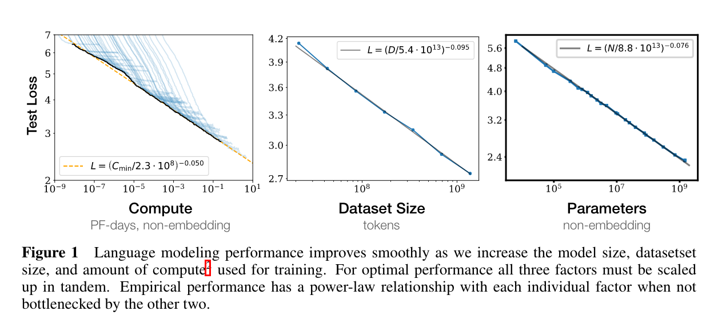
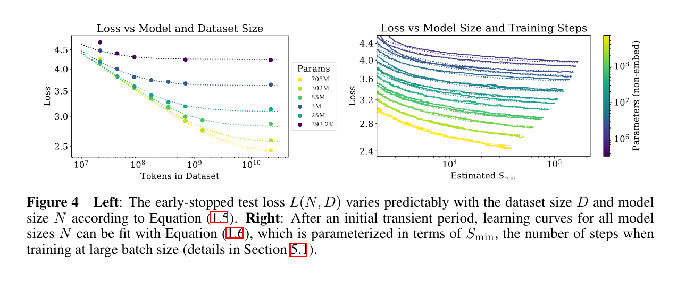
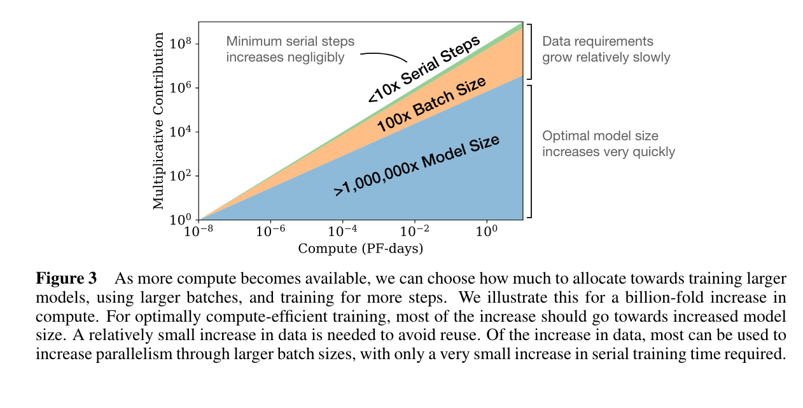
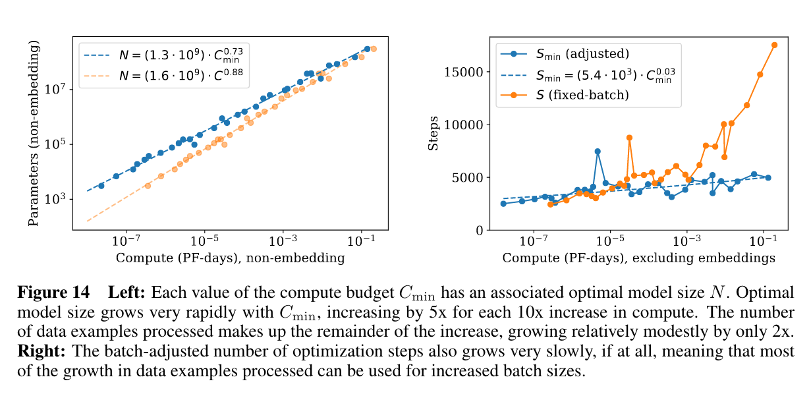
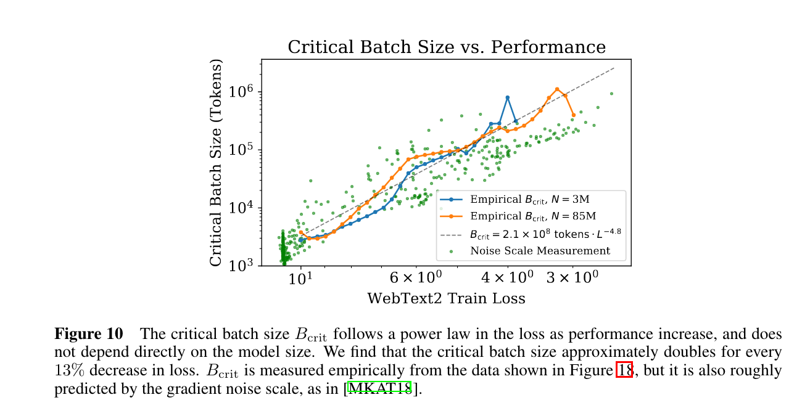

The article "Scaling Laws for Neural Language Models" by Jared Kaplan and colleagues from Johns Hopkins University and OpenAI discusses the empirical study of how language model performance, specifically in terms of cross-entropy loss, scales with various factors including model size, dataset size, and amount of compute used for training. The main findings suggest that language modeling performance improves in a predictable manner when these factors are scaled up, showing strong dependency on scale rather than architectural details like model depth or width. 

Key findings include:
- The performance of Transformer language models improves smoothly as model size, dataset size, and compute are increased, with the loss showing a power-law relationship with each of these factors.
- Larger models are more sample-efficient, achieving better performance with fewer training examples and steps.
- Optimal training for a fixed compute budget involves using very large models and stopping significantly short of convergence, suggesting that maximal compute efficiency diverges from training models to full convergence.
- The study introduces simple equations to predict the effects of scaling on overfitting and training speed, providing a framework for understanding and optimizing the allocation of compute resources in language model training.

The paper contributes to the field by offering a predictive framework for the performance of language models based on scaling laws, indicating that larger models trained on appropriately scaled datasets and compute resources are expected to perform better and more efficiently.

## Scaling laws

1. **Performance vs. Model Size (N):** Performance, measured by cross-entropy loss, improves as a power-law function of model size, with the relationship holding over more than six orders of magnitude. Larger models are more sample-efficient and achieve lower loss values.

2. **Performance vs. Dataset Size (D):** As the dataset size increases, performance improves following a power-law relationship. However, if the model size or dataset size is held fixed while the other is increased, diminishing returns are observed due to overfitting. The study found a predictable penalty based on the ratio \(N^{0.74}/D\), suggesting how to scale dataset size relative to model size to minimize overfitting.

3. **Performance vs. Compute (C):** There is a power-law scaling between performance and the amount of compute used for training, with performance improving as more compute resources are allocated. Optimal performance for a given compute budget involves using large models and stopping training before full convergence.

4. **Optimal Allocation of Compute:** For a fixed compute budget, there's an optimal allocation that involves training very large models on a relatively modest amount of data and stopping well before convergence. This maximizes sample efficiency and performance gains per unit of compute.

5. **Critical Batch Size:** The ideal batch size for training scales as a power law of the loss, suggesting that as models are trained to achieve lower loss values, the optimal batch size increases.

These scaling laws provide a quantitative framework for predicting how changing the size of the model, the size of the training dataset, and the amount of computational resources will affect the training outcome of neural language models. They suggest that larger models, even when trained with less data and for fewer iterations, can outperform smaller models trained to full convergence, emphasizing the importance of model scale in achieving high performance.

## Questions & answers

### Question 1: What are the main factors studied in the paper "Scaling Laws for Neural Language Models" that affect the performance of language models?

**Answer:** The paper studies the effects of three main factors on the performance of neural language models: model size (the number of parameters excluding embeddings), dataset size, and the amount of compute used for training. It identifies empirical scaling laws that describe how these factors influence model performance in terms of cross-entropy loss.

### Question 2: What is the significance of the optimal allocation of compute resources as discussed in the paper?

**Answer:** The paper highlights the significance of optimally allocating compute resources for training language models. It finds that the most compute-efficient training involves using very large models trained on relatively modest datasets and stopping well before convergence. This approach maximizes sample efficiency and performance gains per unit of compute, suggesting that larger models, even when partially trained, can outperform fully converged smaller models.

### Question 3: How do architectural details such as network depth and width affect language model performance, according to the study's findings?

**Answer:** According to the study, within a wide range, architectural details such as network depth versus width and other hyperparameters have minimal effects on model performance compared to the overall scale (model size, dataset size, and compute). The findings suggest that focusing on scaling up the overall resources is more important than fine-tuning architectural details for improving performance.

### Question 4: What does the study reveal about the sample efficiency of larger models?

**Answer:** The study reveals that larger models are significantly more sample-efficient than smaller models. They achieve similar or better levels of performance using fewer data points and fewer optimization steps. This efficiency makes larger models preferable for maximizing the utilization of available data and computational resources.

### Question 5: How does the paper contribute to the understanding of transfer learning in language models?

**Answer:** The paper examines the transferability of language models to different text distributions and finds that performance on transfer tasks is strongly correlated with performance on the training distribution. This indicates that improvements in language modeling, as measured by the scaling laws, are broadly applicable and beneficial across different types of text data, underscoring the general utility of scaling up language models.
