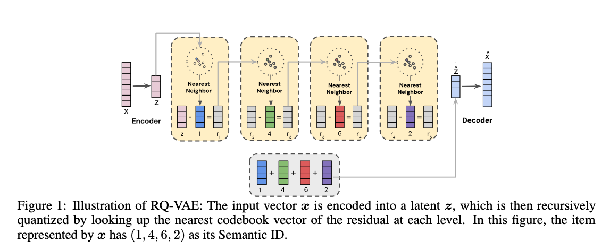

The paper addresses the limitations of randomly hashed item IDs in large-scale recommendation systems, which hinder generalization to new and long-tail items. It proposes replacing random IDs with **Semantic IDs (SIDs)**, compact discrete item representations learned from content embeddings using RQ-VAE. To adapt SIDs for ranking models, the authors test **N-gram** and **SentencePiece (SPM)** tokenization methods, finding SPM superior for balancing memorization and generalization. Experiments on YouTube’s production ranking model show that SIDs outperform both raw content embeddings and random IDs, particularly in handling cold-start and newly introduced videos. Overall, SIDs provide a scalable, efficient, and more generalizable alternative to random IDs in industry-scale recommendation systems.

## key benefits of using **Semantic IDs (SIDs)** in recommendation systems are:

### 1. **Better Generalization to New and Long-Tail Items**

* Randomly hashed IDs do not capture semantic similarity, so unseen or rare items are poorly represented.
* SIDs, derived from content embeddings, allow semantically similar items to share representation space, improving recommendations for new and long-tail items.

### 2. **Efficient Balance Between Memorization and Generalization**

* Pure content embeddings reduce memorization power, while random IDs overfit without generalizing.
* SIDs compress content embeddings into discrete tokens, enabling **memorization (via embedding tables)** while still carrying semantic meaning for generalization.

### 3. **Scalability and Resource Efficiency**

* Directly storing dense embeddings for billions of items is infeasible in production.
* SIDs provide a compact representation (a few integers per item instead of high-dimensional vectors), making them computationally and memory efficient.

### 4. **Improved Cold-Start Performance**

* In experiments with YouTube’s ranking model, SIDs—especially when adapted with **SentencePiece**—showed significant gains for cold-start recommendations (new items added to the corpus).

### 5. **Hierarchical and Meaningful Structure**

* SIDs capture **hierarchical semantic relationships** among items (e.g., sports → outdoor sports → surfing), which random IDs cannot provide.
* This enables more structured and interpretable collisions in embedding tables, helping the model learn from related items.

---

👉 In short: **Semantic IDs improve recommendation quality for new/rare items, reduce resource costs, maintain memorization ability, and introduce semantically meaningful structure into ranking models.**

