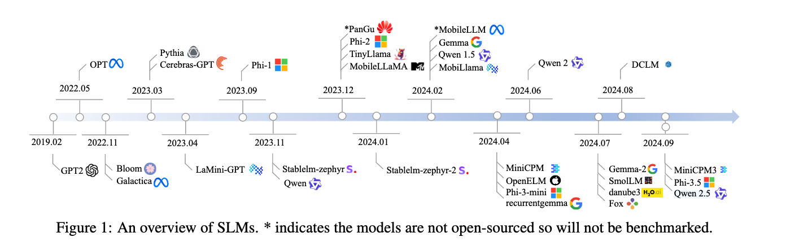
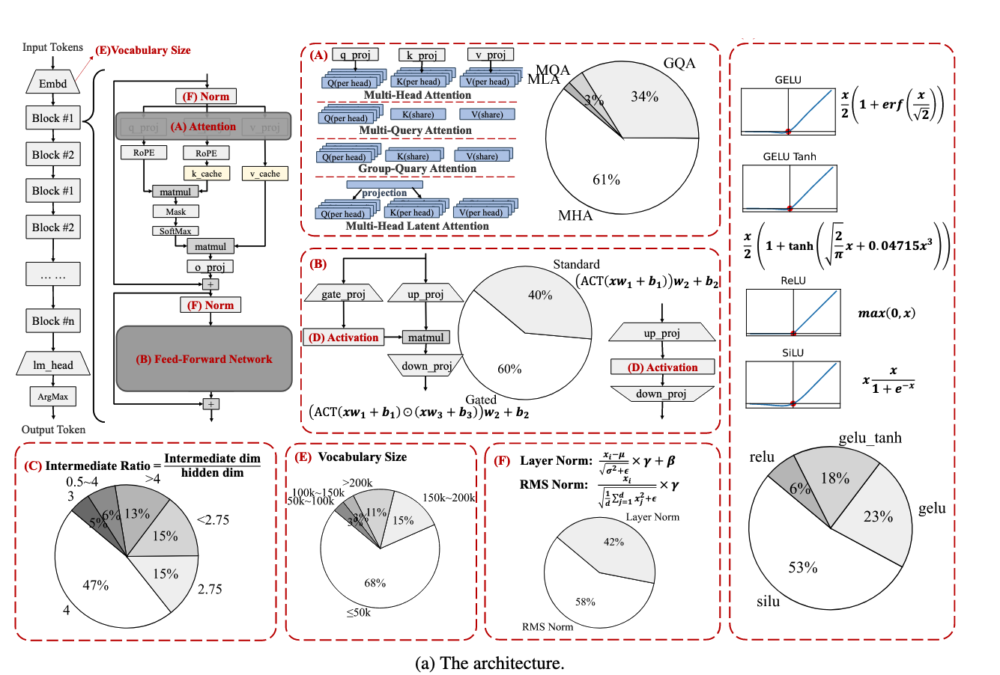
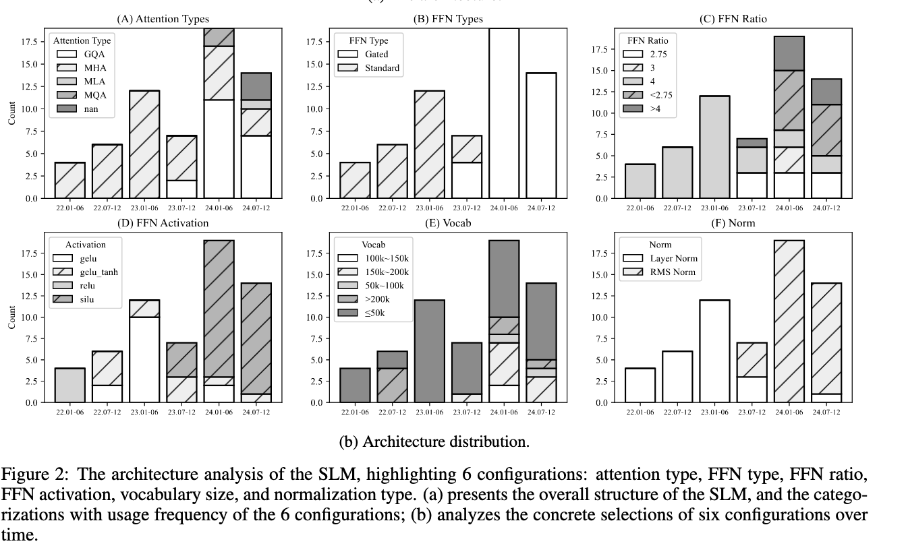

The article **“Small Language Models: Survey, Measurements, and Insights” (arXiv:2409.15790v3)** makes several key contributions:

1. It presents the **first comprehensive survey** of small language models (SLMs), focusing on transformer-based, decoder-only models between **100M and 5B parameters**.
2. The authors **review 70 state-of-the-art SLMs**, analyzing their innovations in **architecture, datasets, and training algorithms**.
3. They conduct **extensive benchmarking** of SLMs across tasks such as commonsense reasoning, problem solving, mathematics, in-context learning, and long-context handling.
4. The paper measures **runtime costs on devices** (e.g., inference latency, memory usage, energy efficiency), highlighting the trade-offs between model design and deployment efficiency.
5. It identifies **key insights**, such as the impact of dataset quality over sheer size, the effectiveness of over-training for deployment, and the role of architectural choices like Group-Query Attention and gated FFNs.
6. The study shows that SLMs have made **substantial progress between 2022–2024**, with improvements surpassing some larger models in specific tasks, narrowing the gap with LLMs.
7. It stresses the importance of **device-aware optimization** (quantization, hardware alignment, and memory efficiency) to make SLMs practical on smartphones and edge devices.
8. Finally, the paper makes all **benchmarking tools and results publicly available**, supporting reproducibility and future research.

In short, the contribution lies in mapping the landscape of SLMs, providing systematic evaluations, and setting directions for future research on making AI more accessible and efficient on personal devices.

## Architecture analysis

## Recommendations for using SLMs

The article offers several **recommendations for effectively using small language models (SLMs)**, based on their survey, benchmarking, and analysis. These are mainly summarized in the *Conclusions and Future Directions* section (pp. 20–21):

---

### 1. **Co-design SLMs with Hardware**

* SLM runtime efficiency depends not only on parameter count but also on architectural choices (depth/width ratio, attention type, activation, quantization-friendliness).
* The authors recommend **co-designing models together with device processors (e.g., NPUs, GPUs)** to achieve an optimal accuracy–speed tradeoff.

---

### 2. **Prioritize Data Quality over Quantity**

* Dataset quality strongly outweighs raw size.
* They highlight **synthetic, model-filtered datasets** like *DCLM* and *FineWeb-Edu* as yielding state-of-the-art open-source SLMs.
* Recommendation: **invest in high-quality or filtered data sources**, not just large-scale corpora.

---

### 3. **Deployment-Aware Scaling (“Revisiting Chinchilla Law”)**

* SLMs are often **over-trained with far more tokens** than scaling laws suggest (e.g., 1B-parameter models trained on >1.5T tokens).
* This is effective for device deployment, but unsustainable long-term.
* Recommendation: develop a **deployment-aware scaling law** that balances training cost, inference efficiency, and lifecycle economics.

---

### 4. **On-Device Personalization**

* Since SLMs run locally, they can be adapted with **personal user data** while preserving privacy.
* Two strategies:

  * *Prompt injection with retrieval-augmented generation* (cheaper, but costly at runtime).
  * *On-device fine-tuning* (better personalization, but resource-heavy).
* Recommendation: explore **lightweight fine-tuning methods** (e.g., zeroth-order optimization, PEFT) that are feasible on mobile hardware.

---

### 5. **Device–Cloud Collaboration**

* SLMs cannot fully replace large LLMs.
* Recommendation: use **SLMs as local filters** for easy/fast tasks, while offloading complex queries to cloud-based LLMs.
* This hybrid setup ensures **privacy, responsiveness, and efficiency**.

---

### 6. **Fair Benchmarking**

* Current benchmarks (e.g., GSM8K, MMLU) are biased or saturated.
* Recommendation: develop **new benchmarks tailored to SLM deployment tasks**, such as auto-reply, GUI understanding, or mobile-specific use cases.

---

### 7. **Sparse and Memory-Efficient SLMs**

* Sparse techniques (MoE, activation sparsity) are underexplored for SLMs due to memory constraints.
* Recommendation: explore **external storage integration (e.g., flash memory)** to handle “cold weights” and break the memory wall.

---

✅ **In essence:** To use SLMs effectively, one should **align model architecture with hardware, focus on high-quality data, adopt deployment-specific scaling, enable personalization, combine with cloud LLMs, build fairer benchmarks, and investigate sparsity/memory optimizations.**

