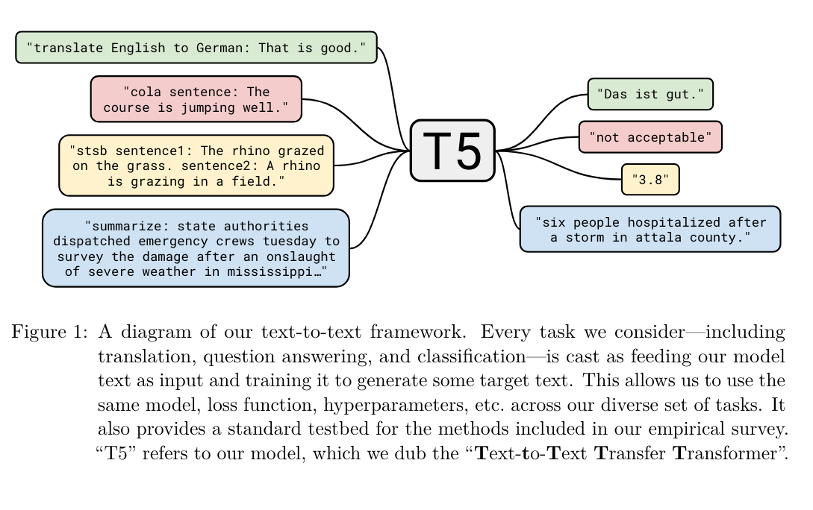

The article presents a comprehensive study on exploring the limits of transfer learning with the unified text-to-text framework, T5 (Text-to-Text Transfer Transformer), developed by researchers at Google. This framework is designed to handle a wide array of natural language processing (NLP) tasks by converting all text-based language problems into a text-to-text format, where both the input and output are treated as sequences of text. This approach allows for a standardized method to train and evaluate models across diverse tasks, using the same model, loss function, and hyperparameters.

The T5 model was evaluated on a large-scale experiment comparing various aspects of model training and architecture, including the effects of different unsupervised learning objectives, the impact of pre-training dataset size and composition, and strategies for fine-tuning on downstream tasks. The study systematically explored these factors across numerous language understanding tasks, with the goal of understanding how to best leverage transfer learning techniques in NLP. This included investigating the efficacy of denoising objectives, where the model learns to predict missing or corrupted parts of the text, and the importance of the size and cleanliness of the pre-training corpus.

The findings from the experiments indicated several key insights. Firstly, the text-to-text framework proved to be a flexible and effective approach for handling a variety of NLP tasks, from translation and summarization to question answering and classification tasks. Secondly, the study found that larger models and longer training times generally led to better performance across most tasks, emphasizing the importance of scale in achieving state-of-the-art results. The researchers also discovered that the choice of pre-training data and learning objectives significantly influenced the model's ability to generalize across tasks, with cleaner, larger datasets and carefully chosen unsupervised objectives leading to substantial improvements.

In summary, the T5 framework demonstrates the power of a unified approach to transfer learning in NLP, with the study's extensive experiments providing valuable insights into optimizing model training and architecture for a wide range of language tasks. The research underscores the potential of scalable, text-to-text models to push the boundaries of what is possible in natural language understanding and generation.

## Main contributions

The main contributions of the article on exploring the limits of transfer learning with a unified text-to-text framework, T5, are as follows:

1. **Unified Text-to-Text Framework:** The introduction of the T5 model, which handles every text-based language problem by converting both inputs and outputs into text sequences. This approach standardizes the training and evaluation process across a wide range of NLP tasks using the same model architecture, loss function, and hyperparameters, showcasing the flexibility and effectiveness of treating different NLP tasks in a unified manner.

2. **Systematic Exploration of Transfer Learning Factors:** The article presents a comprehensive study comparing various elements crucial to the success of transfer learning in NLP. This includes experiments on different unsupervised learning objectives, the impact of pre-training data size and composition, architectural variations, and strategies for fine-tuning on downstream tasks. This systematic exploration helps identify best practices and guidelines for employing transfer learning techniques in NLP.

3. **Colossal Clean Crawled Corpus (C4):** Introduction of a new pre-training dataset, C4, which is derived from the Common Crawl web corpus. The dataset is cleaned using heuristic filtering to improve the quality of the training data. The study demonstrates the importance of the size and cleanliness of the pre-training corpus on the model's ability to generalize across various tasks.

4. **Scaling Up for Better Performance:** The research highlights the significance of model size and training duration, showing that larger models and longer training times generally lead to improvements across a majority of NLP tasks. This underscores the critical role of scale in achieving state-of-the-art results in transfer learning for NLP.

5. **Insights into Optimal Training Strategies:** Through extensive experimentation, the article provides insights into the effectiveness of different training strategies, such as the choice of unsupervised objectives and the method of incorporating supervised tasks during pre-training. These findings contribute to a deeper understanding of how to best leverage unsupervised and supervised learning for transfer learning in NLP.

These contributions collectively advance the field of NLP by demonstrating the potential of a unified, scalable text-to-text approach to transfer learning, providing a foundation for future research and applications that aim to leverage large-scale, generalized models for a wide array of language understanding and generation tasks.

## Questions

1. **What is the T5 model, and how does it approach natural language processing (NLP) tasks?**

   - **Answer:** The T5 (Text-to-Text Transfer Transformer) model is a unified framework designed to handle a wide array of NLP tasks by converting all text-based language problems into a text-to-text format, where both inputs and outputs are treated as sequences of text. This approach standardizes the training and evaluation process across diverse tasks, using the same model architecture, loss function, and hyperparameters, showcasing its flexibility and effectiveness.

2. **What is the significance of the Colossal Clean Crawled Corpus (C4) introduced in the study?**

   - **Answer:** The Colossal Clean Crawled Corpus (C4) is a new pre-training dataset derived from the Common Crawl web corpus and cleaned using heuristic filtering to improve the quality of the training data. The introduction of C4 underscores the importance of the size and cleanliness of the pre-training corpus on the model's ability to generalize across various tasks, highlighting the role of high-quality, large-scale data in successful transfer learning in NLP.

3. **How does the article demonstrate the importance of scale in transfer learning for NLP?**

   - **Answer:** The study demonstrates the importance of scale through experiments showing that larger models and longer training times generally lead to better performance across most NLP tasks. These findings highlight the critical role of model size and training duration in achieving state-of-the-art results, suggesting that scale is a key factor in the success of transfer learning approaches in NLP.

4. **What are some of the key findings regarding unsupervised learning objectives and pre-training data?**

   - **Answer:** The research systematically explores various unsupervised learning objectives and pre-training data configurations, finding that "denoising" objectives, which train the model to reconstruct randomly corrupted text, generally perform similarly and effectively in the text-to-text setup. Additionally, the choice of pre-training data, particularly the use of the C4 dataset, significantly influences the model's generalization capabilities across tasks. Cleaner, larger datasets and carefully chosen unsupervised objectives lead to substantial improvements.

5. **In what ways does the study contribute to future research and applications in NLP?**

   - **Answer:** The study's introduction of the T5 model and the unified text-to-text framework, along with the comprehensive comparison of transfer learning factors, provides a foundation for future research in NLP. The insights into the effectiveness of different model architectures, unsupervised learning objectives, and the significance of pre-training data quality and scale contribute to a deeper understanding of transfer learning in NLP. These contributions pave the way for developing more generalized, scalable models for a wide range of language understanding and generation tasks, driving advancements in the field.
  
