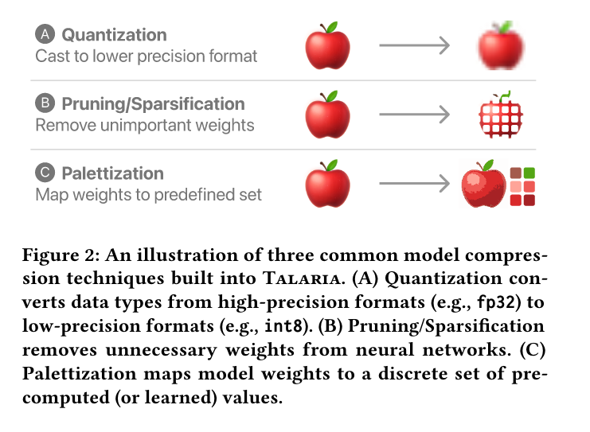
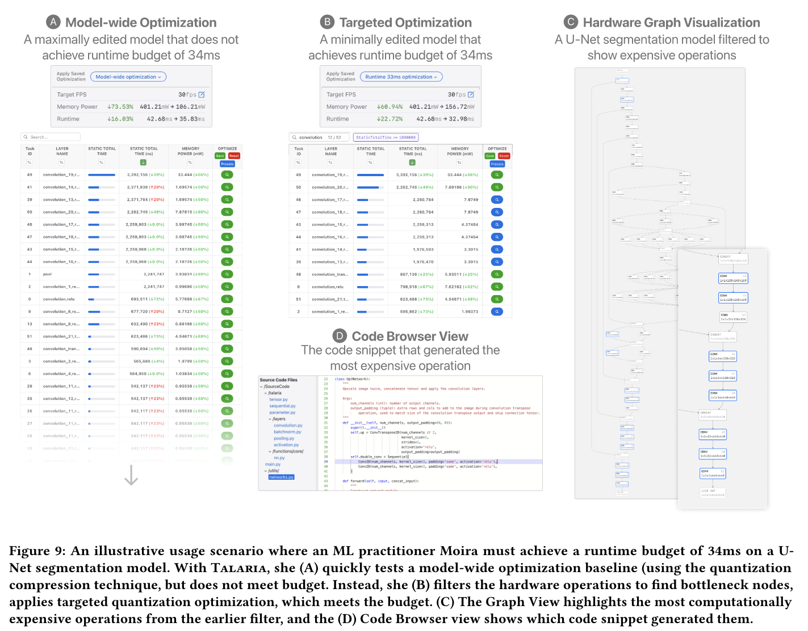

## Types of model compression

## Session workflow

## Example work session

**Scenario setup**: **How to speed up inference of an image segmentation model?** Moira is an ML engineer on a product team developing a model that will power a new feature on a mobile device. The task is image segmentation, and the team decides to use a lightweight U-net architecture [72]. Moira has been iterating on this model to get the best accuracy possible. To ship this model on-device, its inference runtime must be within budget to ensure a good user experience. To start, Moira loads the model into Talaria to benchmark its current runtime. In the system header, she reads off the top-level metrics for the model: “Memory Power: 401.21mW” and “Runtime: 42.68ms.” The allowed runtime budget for this model is 34ms, so she needs to reduce the runtime by about 20%. 

**Visualizing model architecture on hardware**. Moira first familiarizes herself with Talaria, including the two main views: the Table View and Graph View. She sees 51 rows in the Table View, corresponding to 51 model operations running on the hardware. She first wants to get a sense of how these operations are organized, so in Graph View she zooms and pans around the model to inspect the structure generated by the hardware compiler. She sees the U-Net architecture running on hardware represents her expectations: the input and output share the same size, and the two “sides of the U” (called the contracting and expansive paths [72]) are seen from the graph connections running from subsequent convolutional layers from the beginning operations to the final operations. 

**Quick test: Applying model-wide optimizations.** When analyzing a new model, a common baseline is to try model-wide optimization: optimizing every model operation with the same compression technique. Moira wants to see if this quick test satisfies her runtime budget. She clicks the model-wide optimize button and sees multiple compression options supported by Talaria, including quantization, pruning, and palettization. Moira is mainly interested in quantization, so she chooses to cast all input, output, and kernel formats from fp16 to int8. The resulting model (Figure 9A) reports toplevel metrics of reducing memory power by 73.53% (401.21mW → 106.21mW) and runtime by 16.03% (42.68ms → 35.83ms). Note that there is no guarantee that optimizations always make performancebetter, e.g., the overhead of optimization could be larger than the savings. In this example, the runtime of some operations (colored red in the Table View of Figure 9A) are increased. Although this is a big performance improvement, it does not achieve the runtime budget of 34ms. Before trying another optimization, Moira clicks the “Save” button and provides a name “Model-wide optimization,” to keep a checkpoint of her work.

**Analyzing model statistics and finding bottleneck operations**. Before trying a targeted optimization, Moira needs a deeper understanding of the model performance. To inspect model statistics, she reads the Table View to examine existing operations and their runtime distribution. Scrolling through the tasks and reading down the “Layer Name” column, she sees the model is mainly composed of convolution and pooling operations. From model-wide optimization, she finds quantizing pooling layers does not reduce runtime, so she enters “convolution” in search box to focus on these operations. Since the Graph View and Table View are interactively synced, now the Graph View highlights the convolution operations with a blue border. She then sorts the convolution operations by their runtime to reveal the runtime distribution across the model. From the Table View’s “Static Total Time” column, she finds twelve operations take up a majority of the total runtime. She then applies a filter to remove the operations that are less than 1ms. Once again, the Graph View updates to highlight the convolution nodes that satisfy the filter (Figure 9C). These bottleneck operations form the candidate set that Moira wishes to optimize.

**Combining geometric and analytic model knowledge**. Using the “Color by Hardware Stats” feature, Moira visualizes model architecture and runtime together in Graph View. This feature colors each node a shade of blue (darker means longer runtime). She confirms that the darker nodes are the operations she has filtered in the Table View, and makes the observation that they appear at the beginning and end of the model. This is a fast and powerful way to confirm and visually find model bottlenecks. 

**Applying targeted model optimizations**. Moira now has her candidate set of operations for a targeted optimization. She clicks the optimize button for the most computationally expensive operation and sees a list of combinations of compression techniques. Moira starts with quantizing this operation by filtering the table with int8 for the input, output, and kernel; the result shows 39% reduction of the runtime and 66% reduction of the memory power for this single operation. After selecting this option, Talaria applies the optimization and shows Moira the improvements in the table row. The top-level metrics in the system header are also updated to show that the overall memory power is reduced by 43.14% (401.21mW → 228.12mW) and the runtime is reduced by 17.45% (42.68ms → 35.23ms)—this is close but still not under the required budget (34ms). Moira tries to optimize the next most computationally expensive operation with the same quantization. Talaria updates the metrics and shows an improved memory power reduction of 60.94% (401.21mW → 156.72mW) and runtime reduction of 22.72% (42.68ms → 32.98ms). While this optimization’s memory power reduction is not as strong as the model-wide optimization, her targeted optimization (Figure 9B) successfully meets her runtime budget. Note that if an operation is dependent upon other operations, Talaria handles these dependencies and optimizes the corresponding operations.6 Before moving on, Moira clicks the “Save” button and names the analysis “Runtime 33ms optimization.” 

**Sharing optimized models with others and evaluating on hardware.** With her targeted optimization and model-wide baseline analyses completed, Moira wants to share them with her team. In Talaria, she clicks the share button to add emails of team members, who will see this model in their model lists. Moira also copies and pastes the Talaria URL into her team’s chat, so others can directly access the model. Now, other team members can inspect the analysis checkpoints Moira made, fork and create their own optimizations, and share back with her. While her team inspects the results, Moira prepares her code to make the necessary modifications to apply the optimizations. To locate the code to modify, she clicks on each optimized operation, and then clicks the Code Tracking tab, which highlights the code snippet from the Python source code that generated this hardware operation. For better context, Moira clicks on the filename of the snippet to see its location in the codebase (Figure 9D). With her code updated, she now can run and evaluate the optimized model on hardware: she finds the actual runtime was reduced to 33.35%, only around a 1% difference from the predictions made by Talaria. Talaria allowed Moira to understand and experiment, in real-time, with optimizations for her segmentation model, instead of blindly applying compression techniques and waiting longer for hardware benchmarking.
