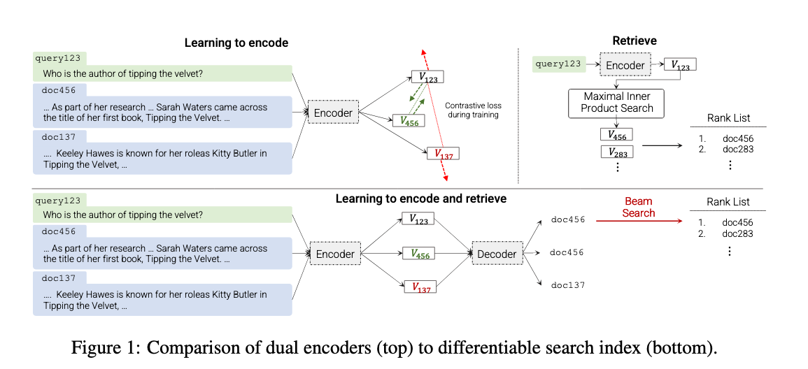
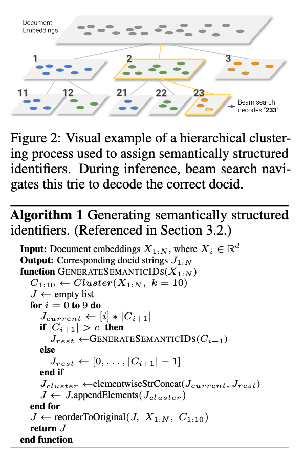

Here are the core concepts of the paper *Transformer Memory as a Differentiable Search Index* (Tay et al., 2022) summarized in 5–10 sentences:

1. The paper introduces the **Differentiable Search Index (DSI)**, a new paradigm where a Transformer model encodes the entire corpus into its parameters and directly maps queries to document identifiers (docids), eliminating the need for traditional retrieve-then-rank pipelines.
2. Instead of using inverted indexes or dense vector search, DSI formulates retrieval as a **sequence-to-sequence task**, where queries are translated into docids via standard model inference.
3. The authors explore multiple **indexing strategies** (e.g., Inputs2Targets, bidirectional, span corruption) and **document representation strategies** (direct indexing, set-based, chunked/inverted indexing), with direct indexing proving most effective.
4. They also evaluate different **docid representation methods**: unstructured atomic identifiers, naive string identifiers, and semantically structured identifiers (generated via clustering). Semantic docids perform best overall, especially in large-scale supervised retrieval.
5. Experiments on the **Natural Questions dataset** (10K–320K documents) show DSI consistently outperforms baselines such as BM25 and dual encoders in both supervised fine-tuning and zero-shot retrieval settings.
6. Scaling experiments reveal that unlike dual encoders, DSI benefits strongly from larger Transformer models, with performance continuing to improve with parameter growth.
7. Results highlight that **zero-shot retrieval** is possible: DSI can retrieve documents even without labeled query–document pairs, often surpassing BM25 and other unsupervised baselines.
8. The approach simplifies retrieval by turning indexing into model training, making updates and extensions conceptually similar to model fine-tuning.
9. Despite its promise, the paper notes challenges such as stability with certain docid types, scalability to very large corpora, and handling dynamic updates.
10. The authors propose DSI as a step toward **end-to-end, generative search systems**, and outline future directions including mixture-of-experts scaling and unsupervised representation learning.

### Indexing Strategies

The goal is to teach the model to associate document tokens with their identifiers (docids). The authors tested four main strategies:

1. **Inputs2Targets**

   * Treats the task as `document tokens → docid`.
   * Simple and effective, since docids are directly the prediction target.
   * Puts identifiers close to the loss function, aligning well with the retrieval task.

2. **Targets2Inputs**

   * Reverses the mapping: `docid → document tokens`.
   * Equivalent to training a generative LM conditioned on docids.
   * Did not produce meaningful results for retrieval.

3. **Bidirectional**

   * Trains both Inputs2Targets and Targets2Inputs in a co-training setup with a prefix token signaling the task direction.
   * Worked reasonably well, but slightly weaker than pure Inputs2Targets.

4. **Span Corruption (with docids)**

   * Uses T5-style denoising, where docids are included and randomly masked.
   * Allows some pretraining effect, but performed poorly for retrieval.

**Finding:** Inputs2Targets is the most reliable indexing strategy, especially when combined with multi-task learning of indexing and retrieval.

### Document Representation Strategies

This addresses how to encode the actual content of documents:

1. **Direct Indexing**

   * Uses the first *L* tokens of each document in order.
   * Most straightforward and consistently the best-performing approach.

2. **Set Indexing**

   * Removes duplicates and stopwords, representing documents as unordered sets of tokens.
   * Showed no additional advantage over direct indexing.

3. **Inverted Index**

   * Associates random contiguous chunks of tokens (rather than whole documents) with a docid.
   * Training instability and weaker performance, since the docid sees inconsistent contexts.

**Finding:** Direct indexing (with relatively short document lengths, e.g., 32–64 tokens) works best. Longer sequences degraded performance due to optimization difficulty.

### Best Combination

The most performant setup is:
✅ **Inputs2Targets indexing strategy** + **Direct Indexing of documents**.

This pairing consistently outperformed alternatives across datasets and scales, providing a stable foundation for retrieval tasks.

---

## Docid Representation Strategies

The way identifiers are represented has a major impact on retrieval quality:

1. **Unstructured Atomic Identifiers**

   * Each document gets an arbitrary, unique token.
   * Simple but creates a huge softmax output space.
   * Pros: Best performance in **zero-shot** retrieval (no labeled query–docid pairs).
   * Cons: Training instability and inconsistent performance in supervised settings.

2. **Naively Structured String Identifiers**

   * Docids are arbitrary integers treated as strings (tokenized like text).
   * Avoids massive softmax overhead.
   * Cons: Performed poorly compared to semantic alternatives, especially at scale.

3. **Semantically Structured Identifiers**

   * Docids are built hierarchically via clustering of document embeddings (like a trie).
   * Semantically similar documents share identifier prefixes.
   * Pros: Strongest performance in **supervised fine-tuning** (especially at large corpus sizes).
   * Cons: Requires preprocessing and clustering.

---

## Combined Insights

* **Indexing strategy**: Inputs2Targets is the best choice (stable, effective).
* **Document representation**: Direct indexing (short prefix of tokens) works best.
* **Docid representation**:

  * **Supervised fine-tuning** → *Semantically structured docids* outperform others.
  * **Zero-shot retrieval** → *Unstructured atomic docids* give the best gains.

---

## Best-Performing Combinations

* **Supervised setting (with labeled queries)**:
  ✅ **Inputs2Targets + Direct Indexing + Semantic String Docids**
  → Highest Hits\@1 and Hits\@10 on Natural Questions, scaling well to 320K docs.

* **Zero-shot setting (index-only training, no query–doc labels)**:
  ✅ **Inputs2Targets + Direct Indexing + Atomic Docids**
  → Outperforms BM25 and SentenceT5 in zero-shot retrieval.

---

📊 *In short*:

* **Inputs2Targets + Direct Indexing** is the foundation.
* Choose **Semantic docids** for supervised, **Atomic docids** for zero-shot.

## How relevant is this paper in 2025?

Many of the concepts from *Differentiable Search Index* (DSI) and similar work are still relevant today, though with caveats. Newer research has built on, modified, or partly replaced some ideas, and in many real-world systems different trade-offs have shifted. Here are some thoughts:

---

## What remains relevant

* **Generative / sequence-to-sequence retrieval** (i.e. mapping from query to document IDs, or other identifiers) is still being explored. For example, the idea of using transformers to *generate* identifiers (or semantic IDs) rather than doing embedding + nearest neighbor search shows up in recent works such as *TIGER: Transformer Index for Generative Recommenders*. ([Emergent Mind][1])
* **Semantic docid / structured identifiers** remain of interest. Representing docids (or item IDs) in a way that captures structure or similarity is still an active dimension, especially when scalability or cold-start/generalization are involved. Tools that quantize or cluster embeddings to get hierarchical/semi-semantic identifiers are part of this. *TIGER* uses “semantic IDs” via hierarchical quantization. ([Emergent Mind][1])
* **Direct (= prefix) document input representations** are still useful, especially in systems where you want lower latency, simpler indexing, and where only part of the document is sufficient. Many dense retrieval methods use passage/segment-level embeddings rather than full-document context.
* **Balancing retrieval strategies**: newer work still considers sparse vs dense vs hybrid vs multi-vector retrievals. Methods like SPLADE (sparse neural retrieval) are being used to combine semantic + lexical bits. ([Wikipedia][2])

---

## What has shifted or become more dominant

* **Dense and hybrid retrieval pipelines** are more common in deployed systems. Many people now use dual-encoder dense retrieval or combinations of sparse + dense (hybrid) rather than purely generative retrieval, for reasons of scalability, stability, and ease of incremental updating.
* **Retrieval-augmented generation (RAG)** and external memory / vector index approaches are very popular. These keep a separate index (vector or sparse), retrieve relevant documents, and then feed them into a large model. This is a contrast with DSI’s idea of encoding everything in the model parameters. ([algorithmiclens.substack.com][3])
* **Efficiency and scalability concerns** have pushed practices like quantization, pruning, multi-vector embeddings, late/early interaction tricks, hybrid sparse/dense indexing, etc. These engineering-tradeoff considerations tend to favor retrieval architectures that separate index storage and search, rather than fully model-parameter based retrieval. ([UWSpace][4])

---

## Are all combinations still “state-of-the-art”?

Some of the combinations favored in the original DSI work (e.g., Inputs2Targets + Direct Indexing + Semantic or Atomic docids) are still viable, but whether they are *best* depends heavily on the use case:

* For **zero-shot retrieval** or small/medium scale, the generative-docid approach can still shine.
* For **large scale** (many millions of documents), frequent updates, latency constraints, or memory constraints, embedding + approximate nearest neighbor (ANN) + hybrid sparse approaches tend to be more practical.
* Also, diversity, interpretability, and system maintenance (e.g. ability to add new documents without retraining) often push toward more modular index + retrieval + re-ranking pipelines rather than monolithic generative indexes.

---

## Conclusion

So in sum: yes, the core ideas from the article are still relevant (especially the taxonomy of indexing/document/docid representations, the idea of generative retrieval, structured docids). But in many real systems the trade-offs have favored more hybrid/dense/sparse + external index pipelines, because of scalability, ease of updates, and latency.

[1]: https://www.emergentmind.com/topics/transformer-index-for-generative-recommenders-tiger?utm_source=chatgpt.com "TIGER: Transformer Index for Generative Recommenders"
[2]: https://en.wikipedia.org/wiki/Learned_sparse_retrieval?utm_source=chatgpt.com "Learned sparse retrieval"
[3]: https://algorithmiclens.substack.com/p/deep-dive-into-retrieval-enhanced?utm_source=chatgpt.com "Deep Dive into Retrieval-Enhanced Transformers (RETRO)"
[4]: https://uwspace.uwaterloo.ca/items/05e9d9fb-dac1-4ff8-ae04-a9a6a83933c5?utm_source=chatgpt.com "Pretrained Transformers for Efficient and Robust Information Retrieval"
