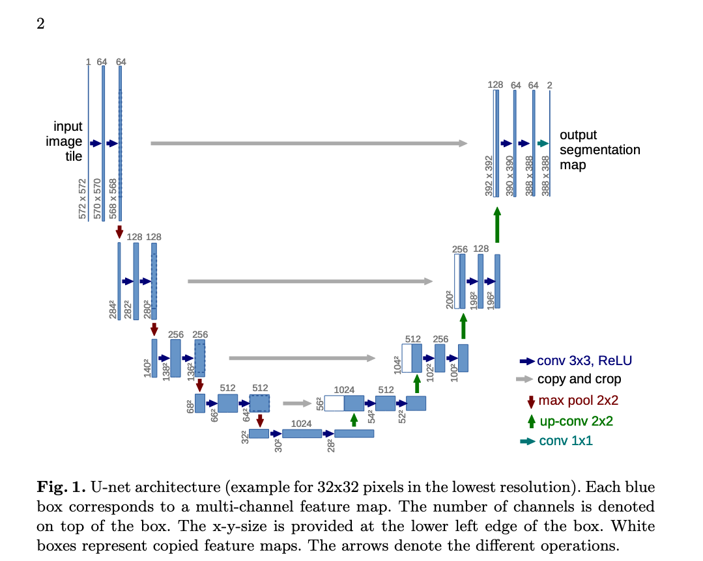

## Summary

The main contribution of this article is the introduction of **U-Net**, a convolutional neural network architecture designed for biomedical image segmentation. The key innovations include:

1. **Efficient Use of Annotated Samples**: The architecture utilizes data augmentation techniques to make the most of limited annotated training data, which is crucial in biomedical applications where large datasets are often unavailable.
   
2. **Symmetric Architecture**: U-Net features a contracting path for capturing context and an expansive path for precise localization. This U-shaped architecture helps retain both high-level contextual and detailed localization information.

3. **Fast and Accurate Segmentation**: The U-Net architecture achieves state-of-the-art performance in various segmentation challenges, including the ISBI cell tracking challenge and the segmentation of neuronal structures in electron microscopy. It outperforms previous methods by a large margin while being computationally efficient, with segmentation times of under one second for 512x512 images on a GPU.

4. **Flexible and Generalizable**: The network can be trained end-to-end with few images, making it applicable to a wide range of biomedical segmentation tasks beyond the specific datasets tested in the paper.

The authors also provide a Caffe-based implementation and trained models, enabling other researchers to apply the U-Net architecture to new problems.

## Architecture

The U-Net architecture is a fully convolutional neural network designed for image segmentation. Its key components are:

1. **Contracting Path (Encoder)**: This is similar to a traditional convolutional neural network, consisting of repeated applications of two 3x3 convolutions, each followed by a rectified linear unit (ReLU) and a 2x2 max pooling for downsampling. At each downsampling step, the number of feature channels is doubled, which helps capture context.

2. **Expanding Path (Decoder)**: This path upsamples the feature maps using 2x2 up-convolutions that halve the number of feature channels. It is symmetric to the contracting path. After each upsampling step, a concatenation is performed with the corresponding feature map from the contracting path, followed by two 3x3 convolutions and ReLU activation. This helps retain spatial information and enables precise localization.

3. **Skip Connections**: High-resolution features from the contracting path are combined with upsampled outputs in the expanding path through skip connections, improving segmentation accuracy.

4. **Final Layer**: A 1x1 convolution is applied at the end to map the feature maps to the desired number of output classes (typically for pixel-wise classification).

The architecture ensures seamless segmentation by using an overlap-tile strategy, allowing it to handle large images efficiently.

## Q & A

Here are five review questions with answers based on the U-Net paper:

### 1. **What is the primary problem that U-Net aims to solve?**
   - **Answer**: U-Net is designed to solve biomedical image segmentation tasks, where the goal is to assign a class label to each pixel in an image, enabling the detection and localization of structures in biomedical images with limited annotated data.

### 2. **How does the U-Net architecture differ from traditional convolutional networks used for image classification?**
   - **Answer**: Unlike traditional convolutional networks that output a single class label per image, U-Net outputs a label for each pixel, enabling pixel-wise segmentation. It features a symmetric encoder-decoder structure, where the encoder captures context and the decoder provides precise localization. It also uses skip connections to combine high-resolution features from the encoder with the upsampled features in the decoder.

### 3. **What data augmentation technique is crucial for U-Net’s success in biomedical image segmentation?**
   - **Answer**: Elastic deformation is the key data augmentation technique used in U-Net. This technique generates realistic variations in the training data, helping the network learn invariance to common deformations in biomedical images, especially when only a few annotated samples are available.

### 4. **What are the two main challenges U-Net addresses compared to the sliding-window approach used in previous segmentation networks?**
   - **Answer**: The two main challenges addressed by U-Net are:
     1. **Speed**: The sliding-window approach is slow because it processes each image patch individually.
     2. **Localization vs. Context**: Sliding-window methods struggle to balance between accurate localization and large contextual information, while U-Net captures both through its encoder-decoder architecture and skip connections.

### 5. **What results did U-Net achieve on the ISBI cell tracking and neuronal structure segmentation challenges?**
   - **Answer**: U-Net significantly outperformed previous methods in both the ISBI 2015 cell tracking challenge and the neuronal structure segmentation challenge. It achieved a 92% intersection-over-union (IOU) score on the "PhC-U373" dataset and 77.5% IOU on the "DIC-HeLa" dataset. It also set new benchmarks for the segmentation of neuronal structures in electron microscopy, surpassing the previous best model on the ISBI challenge.
